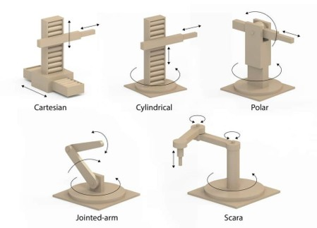
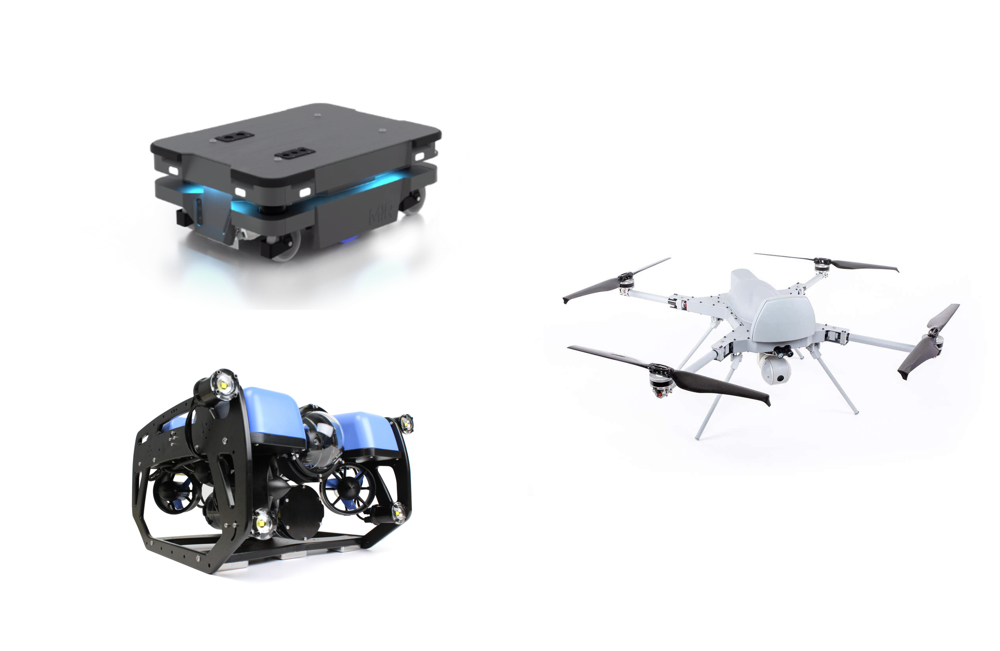
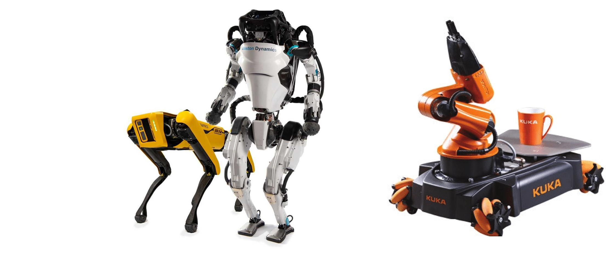

# Robot Taxonomies

## Robot Definition

> **“A goal oriented machine that can sense, plan, and act.”**
> — Peter Corke

A robot perceives its surroundings and, guided by a goal, decides on an action to take. That action could be moving the end-effector of a robotic arm to pick up an object, or navigating a mobile robot to a specific location, in other words that physically interacts with the environment.

**Is it a robot?**

??? example "Industrial robot arm (car assembly line)"
     **Robot**

    An industrial manipulator that:
    
    - **Senses**: joint encoders, sometimes force/torque sensors or safety scanners  
    - **Plans**: trajectories to weld, paint, or assemble according to a production goal  
    - **Acts**: moves its joints and end-effector to manipulate parts

??? example "Simple electric drill"
     **Not a robot**

    - **Acts**: spins when the trigger is pressed  
    - **Missing**: no autonomous sensing of the environment, no planning toward a goal  
    - It simply executes the user’s direct command.

??? example "Desktop or laptop computer"
     **Not a robot (by itself)**

    - Can run planning algorithms, but:  
      - Does **not** typically sense the physical environment in a robotics sense.  
      - Does **not** act on the physical world (no wheels, no motors, no grippers).  
    - Better thought of as a possible **“brain”** for a robot, not the robot itself.

??? example "Autonomous vacuum cleaner"
     **Robot**

    A mobile platform that:
    
    - **Senses**: bump sensors, cliff sensors, sometimes cameras or LiDAR  
    - **Plans**: coverage paths, obstacle avoidance, and how to return to the dock  
    - **Acts**: drives its wheels and controls suction to achieve the goal of cleaning

??? example "Washing machine"
     **Not a robot**

    - Runs a **preprogrammed script** (wash → rinse → spin).  
    - Limited sensing (e.g., water level), but it does *not* choose actions based on a high-level goal.  
    - Considered an **automated machine**, not a sense–plan–act robot.

??? example "Remote-controlled toy car"
     **Not a robot**

    - The **human** does all the sensing and planning.  
    - The car just follows direct commands (forward, turn, stop).  
    - No autonomous goal-directed behavior.

??? example "Smart speaker / voice assistant"
     **Not a robot**

    - **Senses**: audio via microphones.  
    - **Plans**: decides on responses or cloud actions.  
    - **Acts**: mainly outputs sound or data; no movement or manipulation.  
    - An **intelligent interface**, not a physical robot.

??? example "3D printer or CNC machine"
     **Not a robot**

    - **Acts**: moves a toolhead very precisely.  
    - **Senses**: minimal (limit switches, basic feedback).  
    - Executes a fixed program (G-code) rather than planning actions to achieve a high-level goal.  
    - Under a strict *sense–plan–act* definition, usually treated as an **automated machine**, not a robot.

??? example "Quadcopter drone"
    **Robot**

    A flying platform that:
    
    - **Senses**: IMU (accelerometers, gyroscopes), GPS, barometer, sometimes cameras or LiDAR  
    - **Plans**: stabilizes its attitude, follows waypoints, avoids obstacles, or tracks targets  
    - **Acts**: controls its motors and propellers to move and hover in 3D space toward a goal (e.g., hold position, follow a path, film a subject)

## Types of robots

Robots can be classified in many different ways. Here are some common taxonomies:

- **By application domain**: industrial robots, service robots, medical robots, agricultural robots, military robots, space robots, etc.

- **By morphology**: manipulators (robot arms), mobile robots (wheeled, legged, aerial, underwater), humanoid robots, swarm robots, etc.

- **By autonomy level**: teleoperated robots, semi-autonomous robots, fully autonomous robots.

**Robots by morphology**

*Manipulators*

Designed to work in a fixed workspace, these robots stand out for their ability to perform precise, repetitive tasks. Manipulator robots are defined by the joint structure that connects the base to the end-effector. They are often used in industrial settings for tasks such as assembly, welding, and painting. We can find them as RRR, RRP, or other combinations of revolute (R) and prismatic (P) joints.

The main examples are:

- Cartesian Robots (PPP)
- SCARA Robots (RRP)
- Articulated Robots (RRR)
- Spherical Robots (RRP)
- Cylindrical Robots (RPP)
- Delta Robots (RRR)

{width="50%"}

*Mobile Robots*

Designed to move through their environment, either autonomously or under control, across different spaces. They are defined by their locomotion method. Typically used for exploration, transportation, and service tasks.

The main examples are:

- Wheeled robots
- Legged robots
- Tracked robots
- Aerial robots (drones / UAVs)
- Underwater robots (ROVs / AUVs)

{width="80%"}

*Hybrid Robots*

Hybrid robots combine mobility and manipulation capabilities in a single system, or integrate multiple types of robotic structures to perform complex tasks. A typical example is a mobile platform equipped with one or more robotic arms, or a humanoid robot that can both walk and grasp objects. These robots are usually designed for highly specific or demanding tasks that require moving through the environment and physically interacting with it.

{width="80%"}

  <a href="../T0_4" class="md-button md-button--primary">Joint Types -></a>

