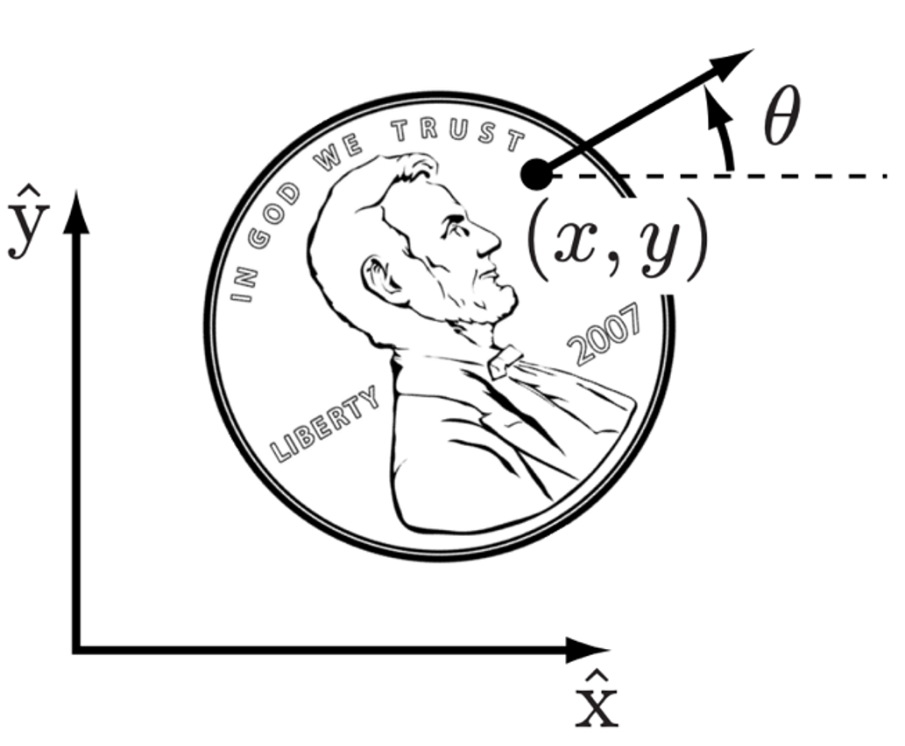
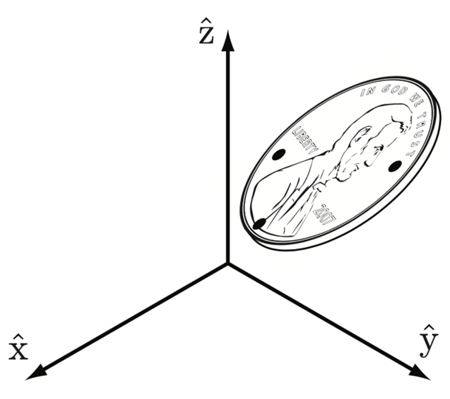

# Degrees of Freedom

**configuration**: a specification of the positions of all the points of a mechanism

**degrees of freedom (dof)**: number of real numbers required to describe a configuration

In a rigid body, the dof corresponds to the number of independent displacements (translations and rotations) that the body can undergo in space.

- dof of a planar body: m = 3

{width="40%"}

- dof of a spatial body: m = 6

{width="40%"}

To represent a robot we assume it is made up of rigid bodies (links) connected by joints. The total dof of the robot is determined by the number of links and the types of joints connecting them.

## Joint Types

There are six basic types of robot joints.

A 0-DOF joint is called the Fixed Joint , where the child link is rigidly connected to the parent link.

1-DOF Joints:

- The **revolute joint (R)**, also called a hinge joint, allows rotational motion about the joint axis
    - Rotational motion with no limit is called a **Continuous Joint**
- **The prismatic joint (P)**, also called a sliding or linear joint, allows translational (or rectilinear) motion along the direction of the joint axis
- The **helical joint (H)**, also called a screw joint, allows simultaneous rotation and translation about a screw axis.

Multiple DOF Joints:

- The **cylindrical joint (C)** has two DOF and allows independent translations and rotations about a single fixed joint axis
- The **universal joint (U)** is another two-DOF joint that consists of a pair of revolute joints arranged so that their joint axes are orthogonal
- The **spherical joint (S)**, also called a ball-and-socket joint, has three DOF and functions much like our shoulder joint.
- The **planar joint** allows two translational and one rotational motion in a plane.

{width="80%"}

    <a href="../T0_3" class="md-button md-button--primary"><- Robot Taxonomies</a>
    <a href="../T0_6" class="md-button md-button--primary">Config Spaces -></a>

