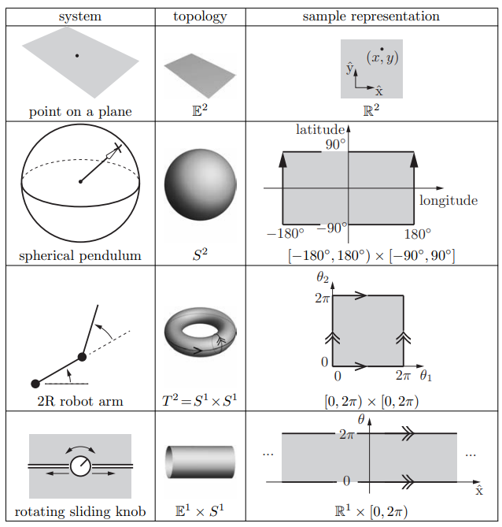

# Configuration space (C-space) vs Workspace (W-space)

## **Topology**

$\mathbb{R}^n$ in this context represents possible states or positions in translation.

$S^1$ in this context represents possible states or positions in rotation.

We describe the position of a robot's links and joints using the configuration space.

## **Configuration Space (C-space)**

**Definition**. The configuration of a robot is a complete specification of the position of every point of the robot. The minimum number n needed to represent the configuration is the number of degrees of freedom (dof) of the robot. The n-dimensional space containing all possible configurations of the robot is called the configuration space (C-space). The configuration of a robot is represented by a point in its C-space.

- Examples (Different topologies with a two-dimensional C-space):

{width="65%"}

## **Workspace (W-space)**

**Definition**. The set of end-effector poses (position/orientation) attainable by some configuration(s) $q$. Often we study just positions (e.g., tip position in the plane) or full poses in 3D space $SE(3)$.

Sometimes we can classify them as:

- Reachable workspace: poses attainable in at least one orientation.
- Dexterous workspace: poses where all orientations (or a specified set) are attainable; a subset of reachable.

Different $q$ can map to the same point in W-space. Therefore, there exists a mapping $x = f(q)$ from C-space to W-space, where $x$ is the end-effector pose in W-space.

For example, 2R planar arm:
    - C-space: $S^1 \times S^1$ (torus)
    - W-space: an annulus with radii
        - min radius = $|l_1 - l_2|$
        - max radius = $l_1 + l_2$

Which would mean The workspace is the image of $C$ under $f$; many $q$ can map to the same $x$.

!!! Nomenclature in spaces
    - $q \in C$: configuration (joint variables).
    - $x \in W$: task/pose (position/orientation).

Here are some demonstrations on a [simulator](https://demonstrations.wolfram.com/RobotManipulatorWorkspaces/).

    <a href="../T0_4" class="md-button md-button--primary"><- Degrees of Freedom</a>
    <a href="../T0_7" class="md-button md-button--primary">Constraints -></a>

