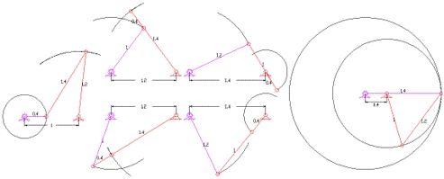
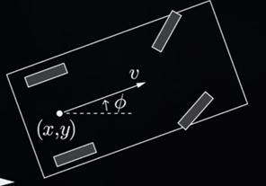

# Constraints in Robotics — Holonomic, Non-holonomic, and Pfaffian Form
---

## 1) Where constraints live

- **Configuration space** \( \mathcal{C} \): points \( q \) (configurations).  
- **Tangent space** \( T_q\mathcal{C} \): vectors \( \dot q \) (instantaneous motions at \( q \)).  
- **Workspace** \( \mathcal{W} \): points \( x \) (end-effector poses); velocities \( \dot x \in T_x\mathcal{W} \).

> **Key idea.**  
> **Holonomic** constraints carve subsets of \( \mathcal{C} \) (where you may be).  
> **Non-holonomic** constraints restrict directions in \( T_q\mathcal{C} \) (how you may move *instantaneously*).

---

## 2) Holonomic constraints (position-level)

**Definition.** Integrable relations on configuration:
$$
g(q) = 0, \qquad h(q) \le 0 .
$$

**Where:**  
- \( q \in \mathcal{C} \): configuration (joint angles/lengths, etc.).  
- \( g:\mathcal{C}\!\to\!\mathbb{R}^{k} \): equality constraints (e.g., loop closure).  
- \( h:\mathcal{C}\!\to\!\mathbb{R}^{m} \): inequality constraints (e.g., joint limits, collision buffers).  

- **Effect:** Remove configurations from \( \mathcal{C} \).  
- **Examples:**  
  - Joint limits: \( \theta_i^{\min} \le \theta_i \le \theta_i^{\max} \).  
  - Loop-closure equations in closed chains.  
  - Collision/obstacle avoidance inequalities.  
- **Planning view:** Treat as **forbidden sets** in \( \mathcal{C} \). They can change the topology (disconnect components, create holes).

{width="60%"}

---

## 3) Non-holonomic constraints (velocity-level)

**Definition.** Linear constraints on velocities, typically **Pfaffian**:
$$
A(q)\,\dot q = 0 .
$$

**Where:**  
- \( A(q) \in \mathbb{R}^{r\times n} \): rows are linear one-forms (each row = one instantaneous restriction).  
- \( \dot q \in T_q\mathcal{C} \): generalized velocity.  

- **Effect:** Restrict **instantaneous directions** in \( T_q\mathcal{C} \); do *not* directly remove configurations.  
- **Non-integrability:** There is no globally valid \( g(q)=0 \) equivalent on the same domain.  
- **Intuition:** Though some instantaneous motions are forbidden (e.g., sideways slide), you can often reach many configurations by **sequencing** admissible motions (e.g., parallel parking).

{width="60%"}

---

## 4) Holonomic vs Non-holonomic — quick contrasts

| Aspect | Holonomic | Non-holonomic |
|---|---|---|
| Mathematical form | \( g(q)=0,\ h(q)\le0 \) | \( A(q)\dot q=0 \) (Pfaffian) |
| Lives in | \( \mathcal{C} \) (configuration set) | \( T_q\mathcal{C} \) (velocity directions) |
| Primary effect | Removes configurations | Removes instantaneous directions |
| Integrability | By definition integrable | Not integrable to equivalent \( g(q)=0 \) |
| Canonical example | Joint limits, loop closure | No-slip wheel, knife-edge skid |
| Planning impact | C-obstacles/feasible sets | Paths built from admissible motions |

---

## 5) Nomenclature (spaces)

- \( q \in \mathcal{C} \): configuration (joint variables).  
- \( \dot q \in T_q\mathcal{C} \): instantaneous motion.  
- \( x \in \mathcal{W} \), \( \dot x \in T_x\mathcal{W} \): pose and velocity in workspace.  
- **Holonomic:** \( g(q)=0 \), \( h(q)\le0 \).  
- **Non-holonomic (Pfaffian):** \( A(q)\dot q=0 \).  
- Inputs: \( \dot q = B(q)u \) with \( A(q)B(q)u=0 \).

---

> Quick mnemonic: **Holonomic = where; Non-holonomic = how**.

    <a href="../T0_6" class="md-button md-button--primary"><- Config Spaces</a>
    <a href="../T0_8" class="md-button md-button--primary">Install ROS -></a>

