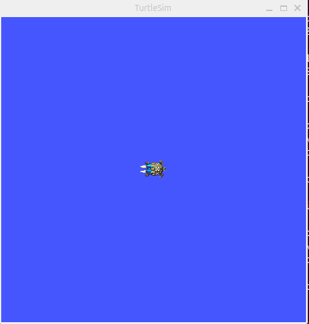
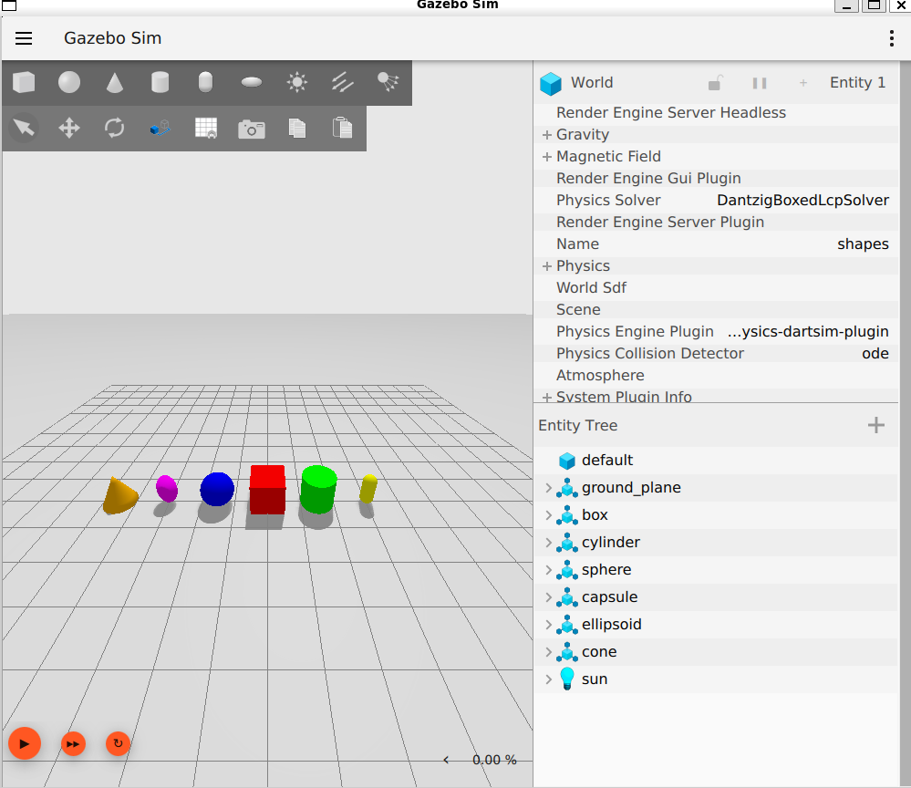
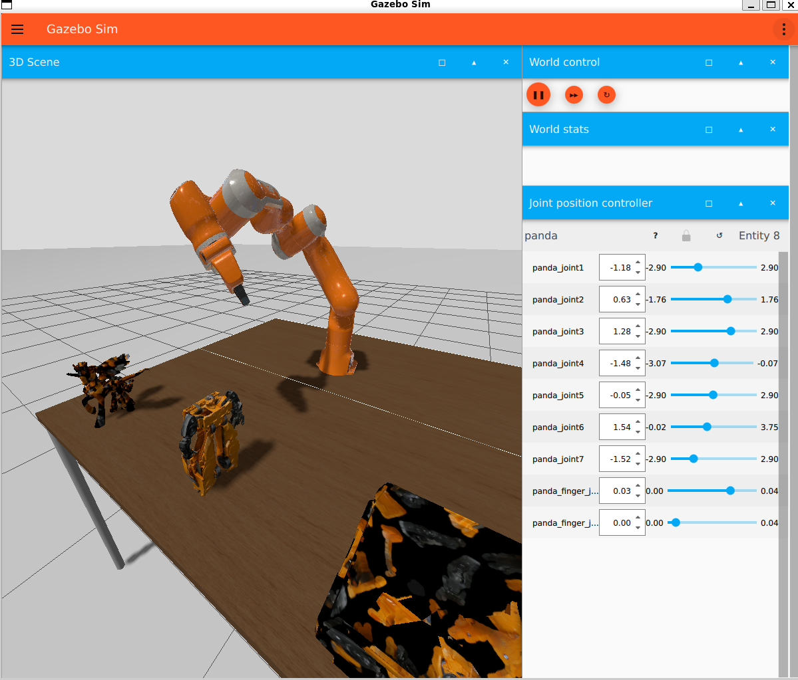

# Install and configure ROS

## 1. Install WSL2 and Ubuntu 24.04

- **If you are already on native Ubuntu:** skip this **Step 1** entirely (WSL2 + Ubuntu installation).
- **If you are on Windows 11:** follow all steps.

WSL2 (Windows Subsystem for Linux 2) is an improved version of WSL that allows you to run native Linux distributions on Windows without traditional virtual machines.

Open **PowerShell** as administrator:

```bash
wsl --install -d Ubuntu-24.04
```

This command:

- Enables Windows Subsystem for Linux (WSL) and the Virtual Machine Platform
- Sets WSL2 as the default version
- Downloads and installs Ubuntu 24.04 LTS (Noble Numbat is the current stable distro)

## 2. First boot and system update

If you are on Windows, launch Ubuntu (from the Start menu) and create a UNIX username/password (the password will not show characters while you type). Then run:

```bash
sudo apt update
sudo apt full-upgrade -y
```

This will update Ubuntu.

## 3. System configuration for ROS 2

Before installing ROS, we need to configure the system for compatibility.

### 3.1 Configure locale (text encoding)

First, configure the locale (system language/encoding settings). ROS uses **UTF-8**, which prevents issues with special characters in ROS and other programs.

```bash
sudo apt update && sudo apt install locales
sudo locale-gen en_US en_US.UTF-8
sudo update-locale LC_ALL=en_US.UTF-8 LANG=en_US.UTF-8
export LANG=en_US.UTF-8
```

These settings use US English, but **any UTF-8 locale** works.

```bash
locale # Verify it is UTF-8
```

### 3.2 Enable “universe” and add the ROS 2 repository

First, make sure the Ubuntu Universe repository is enabled.

```bash
sudo apt install -y software-properties-common
sudo add-apt-repository universe
```

Now add the ROS 2 GPG key (for apt):

```bash
sudo apt update
sudo apt install -y curl
curl -sSL https://raw.githubusercontent.com/ros/rosdistro/master/ros.key \
  | sudo tee /usr/share/keyrings/ros-archive-keyring.gpg
```

Finally, add the repository to your sources list:

```bash
echo "deb [arch=$(dpkg --print-architecture) signed-by=/usr/share/keyrings/ros-archive-keyring.gpg] \
  http://packages.ros.org/ros2/ubuntu \
  $(. /etc/os-release && echo $UBUNTU_CODENAME) main" \
  | sudo tee /etc/apt/sources.list.d/ros2.list > /dev/null
```

## 4. Install ROS 2 Jazzy Desktop

Update apt to include the changes:

```bash
sudo apt update
sudo apt upgrade
```

Install the full desktop distribution:

```bash
sudo apt install ros-jazzy-desktop
```

## 5. Verify the installation with an example

First, configure the environment. Add ROS setup to your startup file (`~/.bashrc`) so ROS commands are available every time you open a terminal:

```bash
source /opt/ros/jazzy/setup.bash
```

For this test you will need **two terminals**, so open a second terminal.

In one terminal run a simple C++ node called **talker**:

`ros2 run demo_nodes_cpp talker`

In the other terminal run a Python node called **listener**:

`ros2 run demo_nodes_py listener`

You should see the talker printing **Publishing: numbers** and the listener printing **I heard: numbers**, matching the messages. This verifies both the C++ and Python APIs.

We can verify our packages installation with:

```bash
ros2 pkg list
```

We can also list all executables with:

```bash
ros2 pkg executables
```

And filter executables per package with:

```bash
ros2 pkg executables <pkg_name>
```

For example, with `turtlesim`:

```bash
ros2 pkg executables turtlesim
```

To see usage options for `ros2 run`:

```bash
ros2 run -h
```

To run an executable:

```bash
ros2 run <package_name> <executable_name> # RUN structure
ros2 run turtlesim turtlesim_node         # EXAMPLE RUN
```

This will run the following sim:



To test communication, run a new executable from the `turtlesim` package that lets you move the turtle with the keyboard:

```bash
ros2 run turtlesim turtle_teleop_key
```

How does this work? ROS 2 acts as **middleware**, in other words a communication network between different processes, encompassing all executables and connections between them.

!!! You can look at more info here: https://docs.ros.org/en/kilted/Tutorials/Beginner-CLI-Tools/Understanding-ROS2-Nodes/Understanding-ROS2-Nodes.html

### Install (dependencies)

```bash
sudo apt update
sudo apt install ros-jazzy-robot-state-publisher ros-jazzy-joint-state-publisher-gui
# (often also handy)
sudo apt install ros-jazzy-xacro ros-jazzy-rviz2 ros-jazzy-tf2-ros
```

Verify with:

```bash
# If these print a path, they’re already installed:
ros2 pkg prefix xacro
ros2 pkg prefix robot_state_publisher
ros2 pkg prefix joint_state_publisher_gui
ros2 pkg prefix rviz2
ros2 pkg prefix tf2_ros
```

## Install Gazebo Harmonic

**Official guide: [Gazebo Harmonic – Install on Ubuntu](https://gazebosim.org/docs/harmonic/install_ubuntu/)**

```bash
sudo apt update
sudo apt install gz-harmonic
```

**Warning:** In some cases, the `gz` binary may not be in your PATH until you restart your session or re-run `source /opt/ros/jazzy/setup.bash`.

**Test:**

```bash
gz sim shapes.sdf
```

A Gazebo window with a test world should open.



### Launch Gazebo with ROS 2

```bash
ros2 launch ros_gz_sim gz_sim.launch.py
```



Use any example to test.

## Install extension for VS Code


## Sourcing ROS 2


<div class="nav-row nav-row--before-after">
    <a href="../T0_7" class="md-button md-button--primary"><- Constraints</a>
    <a href="../T0_9" class="md-button md-button--primary">ROS2 Concepts -></a>
</div>