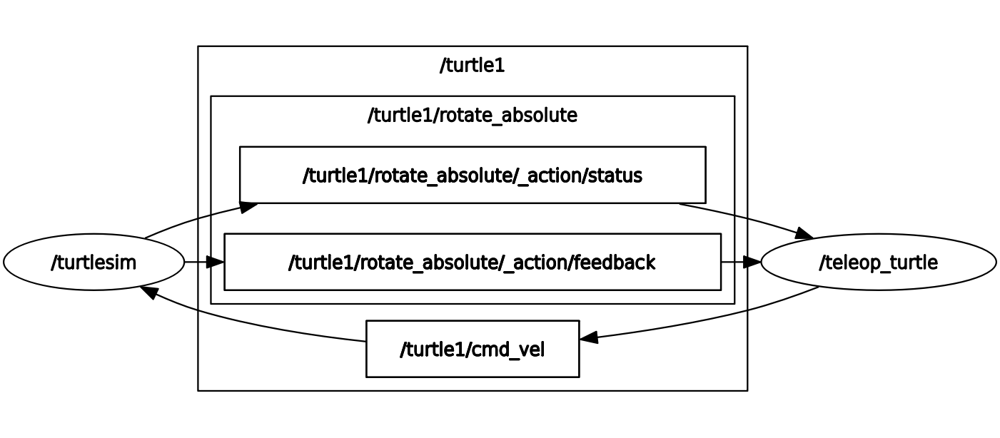

# Ros2 Tools


For ROS2 we will use a lot of command line tools, so it's important to get familiar with them, and how to work it faster. First if we tab complete (double `tab`) after `ros2` we can see all the available commands. We can also get help for any command using `-h` or `--help` after the command, and finally we can use auto-completion for any command by pressing `tab` after writing part of the command.

## Colcon

Colcon (collective construction) is a command-line tool for building, testing, and installing multiple software packages, especially popular in the Robot Operating System (ROS 2) ecosystem, automating complex workflows by handling dependencies, ordering, and environment setup for packages within a workspace, making it easier to manage projects with many interconnected components.

## Rqt

RQt (ROS Qt-based GUI Framework) is a framework for buildin and running graphical tools to visualize, debug and interact with ROS systems. 

It should be installed by default with ROS2, and can be run with:

```bash
rqt
```

helping visualize topics.

To test it we will use a a basic example with turtlesim. First, in one terminal run:

```bash
ros2 run turtlesim turtlesim_node
```

Then, in another terminal run:

```bash
rqt_graph
```

Look at what's appearing.

Now let's run another node to control the turtle. In another terminal run:

```bash
ros2 run turtlesim turtle_teleop_key
```

Refresh rqt and should be able to see both nodes and the topics.




<div class="nav-row nav-row--before-after">
    <a href="../T0_9" class="md-button md-button--primary"><- ROS2 Concepts</a>
    <a href="../T1_1" class="md-button md-button--primary">ROS2 First Program -></a>
</div>