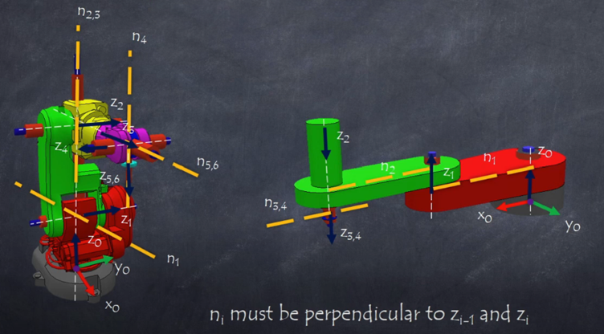
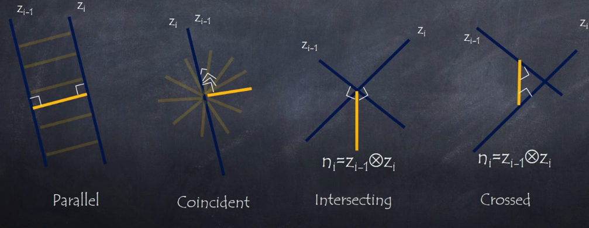

# Forward Kinematics
Kinematics studies motion without considering forces. It focuses on:

- Position
- Velocity
- Acceleration

Manipulator Kinematics:

- Analyzes the geometric and temporal properties of motion.
- Relates the position and orientation of the manipulator's links.
- Reference frames are assigned to parts of the mechanism to describe their relationships.

## Kinematic Chains

A kinematic chain is a series of rigid bodies (links) connected by joints. To analyze a kinematic chain we assume some rules:

- It is assumed that single degree of freedom joints are used, i.e., prismatic or revolute.
- A robot with \(n\) joints will have \(n+1\) links.
- Joints are numbered from 1 to \(n\) and links from 0 to \(n\), so joint \(i\) connects link \(i-1\) and link \(i\).
- Joint \(i\) is fixed with respect to link \(i-1\), so when joint \(i\) is actuated, link \(i\) moves.
- Any joint \(i\) is associated with a variable \(q_i\)
    - If joint \(i\) is revolute, \(q_i\) or \(\theta_i\) is the angle of rotation.
    - If joint \(i\) is prismatic, \(q_i\) or \(d_i\) is the linear displacement.
- The base link (link 0) is fixed to the ground.
- The end-effector is attached to the last link (link \(n\)).

We will use reference frames to describe the position and orientation of each link in the kinematic chain. Which are composed of an origin and three orthogonal unit vectors that define the orientation of the frame.

To start a kinematic analysis, we place a coordinate frame on each link, \(o_i \hat{x_i} \hat{y_i} \hat{z_i}\). With this, we can describe the position and orientation of each link with respect to the previous one. Because the homogenous between \(o_i \hat{x_i} \hat{y_i} \hat{z_i}\) and \(o_{i-1} \hat{x_{i-1}} \hat{y_{i-1}} \hat{z_{i-1}}\) only depends on the joint variable \(q_i\), we can find the position and orientation of the end-effector with respect to the base frame as a function of all joint variables \(q_1, q_2, \ldots, q_n\).

$$
{}^{i}_{j}\mathbf{T}=\mathbf{T}_{i+1}\mathbf{T}_{i+2}\cdots\mathbf{T}_{j-1}\mathbf{T}_{j}
$$

We could in theory place the frames in any way we want, but to simplify the analysis, we will follow a systematic method, which will reduce the number of parameters needed to describe the kinematic chain.

## Denavit-Hartenberg Convention

To systematically assign reference frames to each link, we use the Denavit-Hartenberg (D-H) convention. This method simplifies the kinematic analysis by standardizing the placement of frames based on the robot's geometry.

### D-H Parameters

Denavit, indicates that any homogeneous transformation between two consecutive frames can be described using only four parameters:

1. \( \theta_i \): Joint angle (for revolute joints) or constant angle (for prismatic joints) between \(x_{i-1}\) and \(x_i\) about \(z_{i-1}\).
2. \( d_i \): Joint offset (for prismatic joints) or constant offset (for revolute joints) along \(z_{i-1}\) from \(o_{i-1}\) to the intersection of \(z_{i-1}\) and \(x_i\).
3. \( a_i \): Link length, the distance along \(x_i\) from the intersection of \(z_{i-1}\) and \(x_i\) to \(o_i\).
4. \( \alpha_i \): Link twist, the angle between \(z_{i-1}\) and \(z_i\) about \(x_i\).

  

Using these parameters, we can construct the homogeneous transformation matrix between consecutive frames \(i-1\) and \(i\):

### DH Transformation Matrix

$$
T_i = R_z(\theta_i) t_z(d_i) t_x(a_i) R_x(\alpha_i)
$$

Where:

- \(R_z(\theta_i)\): Rotation about the z-axis by \(\theta_i\).
- \(t_z(d_i)\): Translation along the z-axis by \(d_i\).
- \(t_x(a_i)\): Translation along the x-axis by \(a_i\).
- \(R_x(\alpha_i)\): Rotation about the x-axis by \(\alpha_i\).

Expanding this, we get:

$$
T_i = \begin{bmatrix}
\cos\theta_i & -\sin\theta_i & 0 & 0 \\
\sin\theta_i & \cos\theta_i & 0 & 0 \\
0 & 0 & 1 & 0 \\
0 & 0 & 0 & 1
\end{bmatrix}
\begin{bmatrix}
1 & 0 & 0 & 0 \\
0 & 1 & 0 & 0 \\
0 & 0 & 1 & d_i \\
0 & 0 & 0 & 1
\end{bmatrix}
\begin{bmatrix}
1 & 0 & 0 & a_i \\
0 & 1 & 0 & 0 \\
0 & 0 & 1 & 0 \\
0 & 0 & 0 & 1
\end{bmatrix}
\begin{bmatrix}
1 & 0 & 0 & 0 \\
0 & \cos\alpha_i & -\sin\alpha_i & 0 \\
0 & \sin\alpha_i & \cos\alpha_i & 0 \\
0 & 0 & 0 & 1
\end{bmatrix}
$$

Which simplifies to:

$$
T_i = \begin{bmatrix}
\cos\theta_i & -\sin\theta_i \cos\alpha_i & \sin\theta_i \sin\alpha_i & a_i \cos\theta_i \\
\sin\theta_i & \cos\theta_i \cos\alpha_i & -\cos\theta_i \sin\alpha_i & a_i \sin\theta_i \\
0 & \sin\alpha_i & \cos\alpha_i & d_i \\
0 & 0 & 0 & 1
\end{bmatrix}
$$

### DH Positioning rules

To assign the frames according to the D-H convention, we follow these rules:

1. The \(x_i\) axis is perpendicular to the \(z_{i-1}\) axis.
2. The \(x_i\) axis intersects the \(z_{i-1}\) axis.

Knowing this we can follow these steps to assign the frames:

1. Identify and label the joint axes \(z_0, \ldots, z_{n-1}\), where \(z_i\) is the axis of motion for joint \(i\).
2. Establish the base frame \(O_0\) at any point along \(z_0\). The \(X_0\) and \(Y_0\) axes can be oriented arbitrarily, as long as they are orthogonal to \(Z_0\) and follows the right-hand rule.
    
3. Place the origin \(O_i\) where the common normal to \(z_i\) and \(z_{i-1}\) intersects \(z_i\). If \(z_i\) intersects \(z_{i-1}\), place \(O_i\) at this intersection. If \(z_i\) and \(z_{i-1}\) are parallel, place \(O_i\) at any position along \(z_i\). 
    
4. Establish \(X_i\) along the common normal from \(z_{i-1}\) to \(z_i\), pointing from \(z_{i-1}\) to \(z_i\). If \(z_i\) intersects or is parallel to \(z_{i-1}\), choose any direction for \(X_i\) that is orthogonal to \(z_i\).
5. Determine \(Y_i\) using the right-hand rule to complete the orthogonal frame.