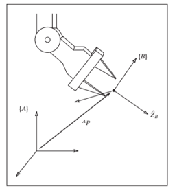
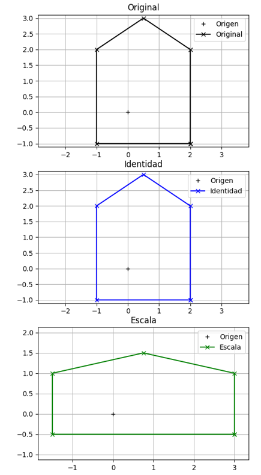

# Spatial Descriptions and Transformations

In robotics, it is essential to describe the position and orientation of objects in three-dimensional space. This is typically done using coordinate frames and transformation matrices.

## Position

The position of a point in 3D space can be represented using a 3-dimensional vector.

- There must be a universal reference frame (often called the "world" frame) to which all other frames are related.

- We can find any point using a vector of position 3x1 relative to a reference frame:

    \[
    {}^{A}_{B}\mathbf{P}_{1} = \begin{bmatrix}
    p_x \\
    p_y \\
    p_z
    \end{bmatrix}
    \]

    where:
    
     \( p_x, p_y, p_z \) are the coordinates of the point in frame B with respect to frame A.

## Orientation

To describe orientation in 3D space, we use a vector of rotation.

- To describe the orientation, we assign to the body its own frame, relative to the reference frame.
- The new frame is described using unit vectors of its main axes (x,y,z) in terms of A.
- By grouping them, it becomes a 3x3 rotation matrix

    \[
    {}^{A}_{B}\mathbf{R} = \begin{bmatrix}
    {}^{A}\hat{X}_B & {}^{A}\hat{Y}_B & {}^{A}\hat{Z}_B
    \end{bmatrix}
    = \begin{bmatrix}
    r_{11} & r_{12} & r_{13} \\
    r_{21} & r_{22} & r_{23} \\
    r_{31} & r_{32} & r_{33}
    \end{bmatrix}
    \]

  

## Transforms

- To be able to represent the behavior of a robot over time, we need to obtain functions that describe how the position and orientation change.

- We require functions that describe movement in space, considering position and orientation, and their transformations: translation and rotation.

### Functions

A function is a mathematical relation that associates each element of a set (domain) with a unique element of another set (codomain).

Let's asume we have a function \( f(p): AP \), where:

- \( A \) is a \( n \times n \) matrix, and \(n\) is the number of dimensions of \( P \).
- \( P \) is a vector of position.
- Functions for transforms must be linear.

For example:

  <!-- Column 1: equation -->
  

        
<em>Identity transformation</em>

        \[
            \begin{bmatrix}
            X_2 \\ Y_2 
            \end{bmatrix}=
            \begin{bmatrix}
            1 & 0 \\ 0 & 1
            \end{bmatrix}
            \begin{bmatrix}
            X_1 \\ Y_1
            \end{bmatrix}
            = \begin{bmatrix}
            X_1 \\ Y_1
            \end{bmatrix}
            \]
        
<em>Scaling transformation</em>

        \[
            \begin{bmatrix}
            X_2 \\ Y_2 
            \end{bmatrix}=
            \begin{bmatrix}
            S_x & 0 \\ 0 & S_y
            \end{bmatrix}
            \begin{bmatrix}
            X_1 \\ Y_1
            \end{bmatrix}
            = \begin{bmatrix}
            S_x X_1 \\ S_y Y_1
            \end{bmatrix}
            \]
  

  <!-- Column 2: image -->
  

    
  

If we use linear functions we have a few benefits:

- The superposition principle applies: the result of applying two functions in sequence is the same as applying a single function that is the sum of the two functions.
- The functions can be inverted: if a function transforms a point from position A to position B
- Multiplication by a scalar is preserved: if a point is scaled by a factor, the transformed point is also scaled by the same factor.