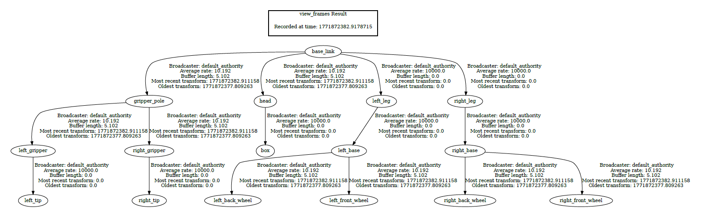

# RViz2 and TF

In this lesson you will **visualize a robot model** and explore its **TF frames** (transforms) using **RViz2** and the `urdf_tutorial` example package.

## Install the `urdf_tutorial` package

Install the binary package for **Jazzy**:

```bash
sudo apt update
sudo apt install ros-jazzy-urdf-tutorial
```

---


## Locate the installed URDF files

Installed packages live under:

```bash
/opt/ros/jazzy/share
```

The `urdf_tutorial` package assets are here:

```bash
cd /opt/ros/jazzy/share/urdf_tutorial/urdf
ls
```

You should see multiple example URDF files (numbered examples).

---

## Launch the URDF demo in RViz2

Run the display launch file and provide a URDF file using the `model:=` argument:

```bash
ros2 launch urdf_tutorial display.launch.py model:=/opt/ros/jazzy/share/urdf_tutorial/urdf/08-macroed.urdf.xacro
```

If your file name differs, use tab-completion after typing:

```bash
ros2 launch urdf_tutorial display.launch.py model:=/opt/ros/jazzy/share/urdf_tutorial/urdf/
```

What you should see:

- An **RViz2** window showing a robot model

<div style="text-align:center; width:80%;">
  
</div>


- A **Joint State Publisher GUI** window (sliders)

<div style="text-align:center;">
  
</div>
---

## RViz2 controls

In RViz2:

- **Left mouse drag**: rotate view
- **Right mouse drag / scroll**: zoom
- **Middle mouse drag (scroll click)**: pan
- The yellow marker indicates the current rotation center (you can move it by panning)


---

## RobotModel: links (rigid parts)

In RViz2, on the left panel:

- Find **RobotModel**
- Expand **Links**

A **link** is a rigid part of the robot (a physical piece).

You can:

- Enable/disable individual links (hide/show parts)
- Adjust **Alpha** (transparency) to see inside the model

---

## 7) TF: frames and transformation matrices

Enable the **TF** display in RViz2 and expand:

- **TF → Frames**

Each frame is a coordinate system attached to a robot part (often one per link/joint region).

### Axis color convention in ROS

In most ROS robots, frames follow this convention:

- **X** axis: **red** (forward)
- **Y** axis: **green** (left)
- **Z** axis: **blue** (up)

So when you see a TF frame in RViz2:
- red arrow = x
- green arrow = y
- blue arrow = z

---

## Move joints

Use the **Joint State Publisher GUI** sliders.

Try moving:

- a wheel joint (rotation)
- a gripper extension (translation)
- a head joint (rotation)

As you move a joint:

- the robot model changes pose
- the TF frames associated with that joint/link update in real time

### What to watch for

- For a **rotation joint**:
  - one axis stays fixed (the axis of rotation)
  - the other axes rotate around it

- For a **translation joint**:
  - the frame shifts linearly along an axis

---

## Node Verification

While the demo is running, check nodes:

```bash
ros2 node list
```

You should see nodes typically like:

- `robot_state_publisher`
- `joint_state_publisher` or `joint_state_publisher_gui`
- `rviz2`

You can also inspect TF topics:

```bash
ros2 topic list | grep tf
```

You should see:
- `/tf`
- `/tf_static`

---

## Get TF frame information

To see all TF frames and their relationships we need to install a tool:

```bash
sudo apt install ros-jazzy-tf2-tools
```

Then run:

```bash
ros2 run tf2_tools view_frames
```
This will generate a PDF file with a graph of all TF frames and their connections.

