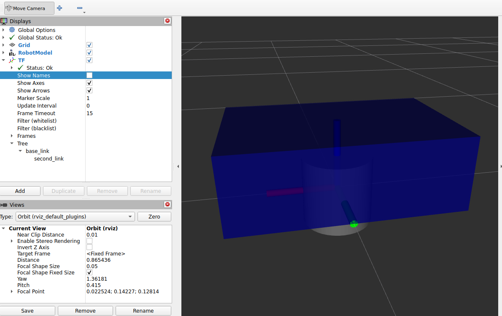
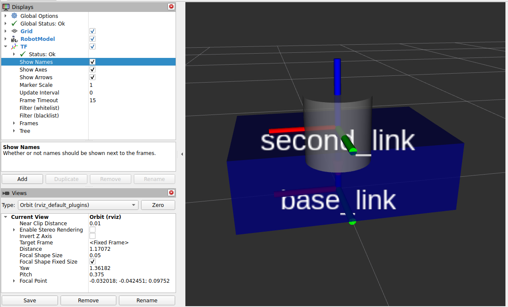
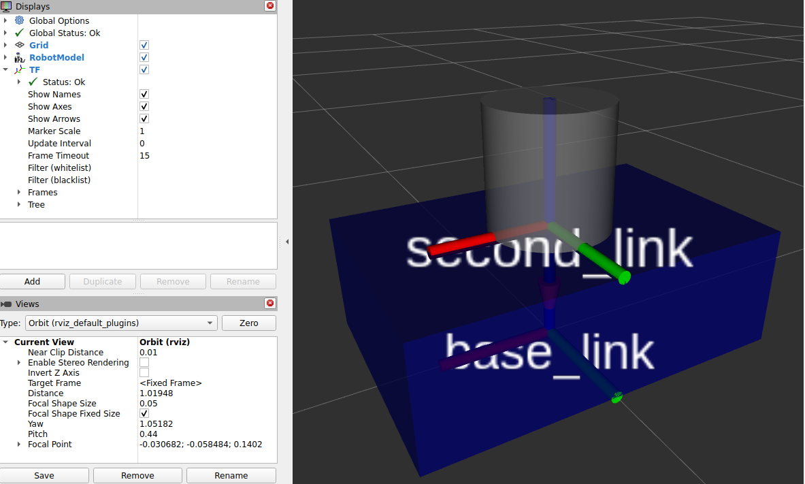
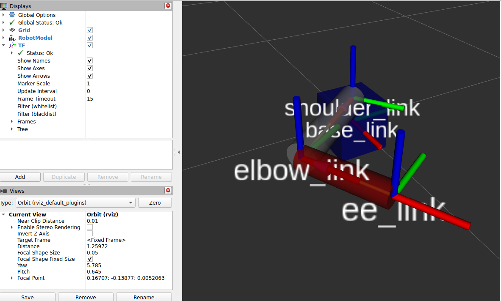

# URDF Basics

In the previous section you saw an intuitive introduction to **TF**.  
Now we begin building our own robot description so TF can be generated correctly.

A **URDF** file (Unified Robot Description Format) is an  XML file that contains:

- **Links**: rigid parts of the robot (chassis, wheel, sensor housing, etc.)
- **Joints**: relationships between links (parent/child), which define **TF frames** and motion

You will also visualize your URDF in **RViz2**.

---

## Learning goals

By the end of this lesson you will be able to:

1. Create a valid URDF file (XML structure)
2. Add a first link (`base_link`) with a visual geometry
3. Add materials (colors) to make visualization readable
4. Add a second link and understand the “multiple root links” error
5. Add a fixed joint to connect links and generate your first TF
6. Follow the correct debugging order:
   **TF first (joint origin), visual later (visual origin)**

---

## Create your URDF file (no ROS package yet)

For now we create the URDF anywhere (e.g., home directory). Later we will place it inside a package.

Create and open the file:

```bash
cd ~your_ws/src
mkdir -p my_robot_description/urdf
cd my_robot_description/urdf
touch my_robot.urdf
```

---

## URDF must start as XML and contain a `<robot>` tag

Add the XML header:

```xml
<?xml version="1.0"?>
```

Add the robot root element:

```xml
<robot name="my_robot">

</robot>
```

Everything you write goes **inside** the `<robot> ... </robot>` tags.

---

## Add the first link: `base_link`

A [Link](https://wiki.ros.org/urdf/XML/link) is a tag that defines a rigid part of the robot. We start with `base_link` because it’s commonly expected by tools.

We will add to `<robot>`, a single link with a visual tag that defines a geometry and an origin (position and orientation of the visual relative to the link frame):

```xml
<link name="base_link">
  <visual>
    <geometry>
      <box size="0.6 0.4 0.2"/>
    </geometry>
    <origin xyz="0 0 0" rpy="0 0 0"/>
  </visual>
</link>
```

### Notes
- Units are **meters**
- Box size = `length width height`
- The visual is centered at the link frame by default

---

## Visualize the URDF in RViz2

Use the `urdf_tutorial` display launch. From the folder containing your URDF:

```bash
ros2 launch urdf_tutorial display.launch.py model:=$HOME/oliver_ws/src/my_robot_description/urdf/my_robot.urdf
```

You should see:
- A box representing `base_link`
- Joint State Publisher GUI (no joints yet)
- RobotModel display with one link

### Fix box position

By default the box is centered on the origin. To place it on the ground, offset the **visual** by half the height:

Height = `0.2` → half = `0.1`

Change:

```xml
<origin xyz="0 0 0.1" rpy="0 0 0"/>
```

Re-run the launch and the box should sit on the ground.

---

## Add a material (color)

If you don’t define a color, RViz often displays links with a default color (commonly red).  
With many links, that becomes confusing. Define materials once, then reuse them.

Add this **above** your links (still inside `<robot>`):

```xml
<material name="blue">
  <color rgba="0 0 0.5 1"/>
</material>
```

Then inside the `base_link` `<visual>`, reference it:

```xml
<material name="blue"/>
```

So your `base_link` visual becomes:

```xml
<link name="base_link">
  <visual>
    <geometry>
      <box size="0.6 0.4 0.2"/>
    </geometry>
    <origin xyz="0 0 0.1" rpy="0 0 0"/>
    <material name="blue"/>
  </visual>
</link>
```
Re-run the launch and the box should now be blue.

---

## Add a second link

Add a second link (example: cylinder). Inside `<robot>`:

```xml
<link name="second_link">
  <visual>
    <geometry>
      <cylinder radius="0.1" length="0.2"/>
    </geometry>
    <origin xyz="0 0 0" rpy="0 0 0"/>
    <material name="gray"/>
  </visual>
</link>
```

Define the gray material (also inside `<robot>`, near the other material):

```xml
<material name="gray">
  <color rgba="0.5 0.5 0.5 1"/>
</material>
```

Now run the launch again:

You will get an error like:

- “Failed to find root link… Two root links found: base_link and second_link”

### Why this error happens

A URDF must form a **tree**:

- one root link
- every other link connected by a joint

Two links with no joint means ROS cannot decide which link is the root.

---

## Add a joint to connect the links

So let's fix it. Now we connect `second_link` to `base_link` with a fixed joint.

Add this inside `<robot>`:

```xml
<joint name="base_second_joint" type="fixed">
  <parent link="base_link"/>
  <child link="second_link"/>
  <origin xyz="0 0 0" rpy="0 0 0"/>
</joint>
```

Now the URDF is a valid tree:
- `base_link` is the root
- `second_link` is a child

Run again and it will load in RViz2.

---

## URDF workflow

When you create a URDF, you will often need to adjust the origins to get the geometry and TF frames in the right place.

At this stage the cylinder may look “wrong” (intersecting the box, floating, etc.).  



That’s expected.

**Rule: do NOT fix the visual first**

You have:

- a **joint origin** (defines TF placement)
- a **visual origin** (offsets geometry relative to the link frame)

If you change both randomly, you will get lost.

### Step 1 — Fix TF using the **joint origin**

We want `second_link` frame to be on top of the box.

Box height is `0.2`, so move the joint up by `0.2` in Z:

```xml
<origin xyz="0 0 0.2" rpy="0 0 0"/>
```

Re-run RViz2 and enable the TF display.  
You should now see `second_link` frame above `base_link` by 0.2 m.

> This is the most important part: **TF is now correct.**



### Step 2 — Fix the cylinder visual using the **visual origin**
The cylinder visual is centered at its link frame.  
Cylinder length is `0.2`, so half is `0.1`.

Offset the cylinder visual in Z by `0.1`:

```xml
<origin xyz="0 0 0.1" rpy="0 0 0"/>
```

Now the cylinder should sit nicely on top of the box.



---

## Full URDF

This is a complete URDF that matches the steps above:

```xml
<?xml version="1.0"?>
<robot name="my_robot">

  <material name="blue">
    <color rgba="0 0 0.5 1"/>
  </material>

  <material name="gray">
    <color rgba="0.5 0.5 0.5 1"/>
  </material>

  <link name="base_link">
    <visual>
      <geometry>
        <box size="0.6 0.4 0.2"/>
      </geometry>
      <origin xyz="0 0 0.1" rpy="0 0 0"/>
      <material name="blue"/>
    </visual>
  </link>

  <link name="second_link">
    <visual>
      <geometry>
        <cylinder radius="0.1" length="0.2"/>
      </geometry>
      <origin xyz="0 0 0.1" rpy="0 0 0"/>
      <material name="gray"/>
    </visual>
  </link>

  <joint name="base_second_joint" type="fixed">
    <parent link="base_link"/>
    <child link="second_link"/>
    <origin xyz="0 0 0.2" rpy="0 0 0"/>
  </joint>

</robot>
```

Run it:

```bash
ros2 launch urdf_tutorial display.launch.py model:=my_robot.urdf
```



---

