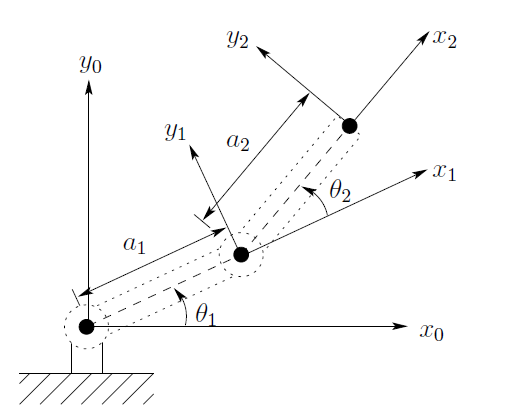

# URDF Joints

So far you have used **fixed joints** to connect links. Fixed joints generate TF, but **no relative motion**.

In this lesson you will learn the most common URDF [joint types](https://wiki.ros.org/urdf/XML/joint) and apply them:

- `fixed`
- `revolute` (rotation with limits)
- `continuous` (rotation without limits)
- `prismatic` (translation with limits)

> Key mindset: **TF first, visual second**  
> 1) Place the joint origin to get correct frames  
> 2) Choose axis + limits  
> 3) Only then adjust visual origins/rotations

---

## Joint type: `revolute` (rotation with limits)

A **revolute** joint rotates around a single axis, but only between a **lower** and **upper** limit. **effort** is the maximum torque in N·m, and **velocity** is the maximum speed, in radians per second.

### Change type to revolute

```xml
<joint name="base_second_joint" type="revolute">
  <parent link="base_link"/>
  <child link="second_link"/>
  <origin xyz="0 0 0.2" rpy="0 0 0"/>
  <axis xyz="0 0 1"/>
  <limit lower="-1.57" upper="1.57" effort="100" velocity="100"/>
</joint>
```

#### Explanation
- `<axis xyz="0 0 1"/>` means rotation around **Z**
- Limits are in **radians**
  - `±1.57` ≈ `±90°`
- `effort` and `velocity` are required fields for revolute in URDF

### Test in RViz2

Launch your URDF with `urdf_tutorial`:

```bash
ros2 launch urdf_tutorial display.launch.py model:=$HOME/oliver_ws/src/my_robot_description/urdf/my_robot.urdf
```

Now the Joint State Publisher GUI should show a slider for this joint, and you can rotate the link.

---

## Axis selection

For an articulated arm, choosing the correct axis is critical:

- If your shoulder joint should swing left/right around **Z** → `0 0 1`
- If it should pitch up/down around **Y** → `0 1 0`
- If it should roll around **X** → `1 0 0`

During class, we saw how to build a robot diagram and relationship between links and joints using DH parameters and conventions. The same principles apply in URDF.

### Quick experiment
Try changing the axis to `1 0 0` and re-launch.
You will see the link rotates in a different plane.

Then revert to the axis that matches your intended arm motion.

---

## Joint type: `continuous` (rotation without limits)

A continuous joint is like revolute **but with no hard limits**.
Typical use in wheeled robots or:

- a wrist roll joint
- any rotating tool or end-effector that can spin indefinitely

### 5.1 Convert revolute → continuous

```xml
<joint name="base_second_joint" type="continuous">
  <parent link="base_link"/>
  <child link="second_link"/>
  <origin xyz="0 0 0.2" rpy="0 0 0"/>
  <axis xyz="0 0 1"/>
</joint>
```

Notes:

- No `<limit>` tag in continuous joints
- The GUI may still show a slider range (often ±π), but that is a limitation of the GUI tool, not the joint itself.

---

## 6) Joint type: `prismatic` (translation with limits)

A prismatic joint slides along one axis within limits.
Common uses:

- linear actuators
- telescopic links
- Z-axis slides (gantry-like mechanisms)

### 6.1 Convert to prismatic
Example: slide `second_link` along X by up to 0.2 m:

```xml
<joint name="base_second_joint" type="prismatic">
  <parent link="base_link"/>
  <child link="second_link"/>
  <origin xyz="0 0 0.2" rpy="0 0 0"/>
  <axis xyz="1 0 0"/>
  <limit lower="0.0" upper="0.2" effort="100" velocity="100"/>
</joint>
```

#### Explanation
- `<axis xyz="1 0 0"/>` means translation along **X**
- Limits are in **meters** for prismatic joints

---

## 7) Recommended workflow

When you add a moving joint to an articulated robot:

1) **Create links** (visual can be rough)
2) **Create the joint with zeros first**
   - origin: `xyz="0 0 0" rpy="0 0 0"`
   - axis: choose a guess
3) **Fix joint origin** (TF placement)  
   - where is the child frame relative to the parent?
4) **Fix joint axis** (motion direction)
5) **Fix joint limits** (if revolute/prismatic)
6) **Only then** adjust the **visual origin** so geometry looks correct

If you get lost, reset and repeat:

- set origins to zero
- fix TF first
- then visuals

---

## Applied Example




| Link | $a_i$ | $d_i$ | $\alpha_i$ | $\theta_i$ |
|--------:|:-----:|:-----:|:----------:|:----------:|
| 1       | $a_1$ | 0 | 0 | $\theta_1$ |
| 2       | $a_2$ | 0 | 0 | $\theta_2$ |


For this example , you can think of:

- `base_link` = base/chassis of the arm
- `shoulder_link` = first arm segment
- `shoulder_joint` = first actuated joint

### Naming convention

- Links: `base_link`, `shoulder_link`, `elbow_link`
- Joints: `base_shoulder_joint`, `shoulder_elbow_joint`


??? NOTE "Solution"
    ```xml
    <robot name="my_robot">
        <link name="base_link">
            <visual>
                <geometry>
                    <box size="0.2 0.2 0.2"/>
                </geometry>
                <origin xyz="0 0 0" rpy="0 0 0"/>
                <material name="blue"/>
            </visual>
        </link>

        <link name="shoulder_link">
            <visual>
                <geometry>
                    <cylinder length="0.4" radius="0.05"/>
                </geometry>
                <origin xyz="0.2 0 0" rpy="0 1.57 0"/>
                <material name="gray"/>
            </visual>
        </link>

        <link name="elbow_link">
            <visual>
                <geometry>
                    <cylinder length="0.3" radius="0.04"/>
                </geometry>
                <origin xyz="0.15 0 0" rpy="0 1.57 0"/>
                <material name="red"/>
            </visual>
        </link>

        <link name="ee_link">
        
        </link>

        <!-- Joints -->
        <joint name="base_shoulder_joint" type="revolute">
            <parent link="base_link"/>
            <child link="shoulder_link"/>
            <origin xyz="0 0 0.1" rpy="0 0 0"/>
            <axis xyz="0 0 1"/>
            <limit lower="-1.57" upper="1.57" effort="10" velocity="1"/>
        </joint>

        <joint name="shoulder_elbow_joint" type="revolute">
            <parent link="shoulder_link"/>
            <child link="elbow_link"/>
            <origin xyz="0.4 0 0" rpy="0 0 0"/>
            <axis xyz="0 0 1"/>
            <limit lower="-1.57" upper="1.57" effort="10" velocity="1"/>
        </joint>

        <joint name="elbow_ee_joint" type="fixed">
            <parent link="elbow_link"/>
            <child link="ee_link"/>
            <origin xyz="0.3 0 0" rpy="0 0 0"/>
        </joint>    

    </robot>
    ```

