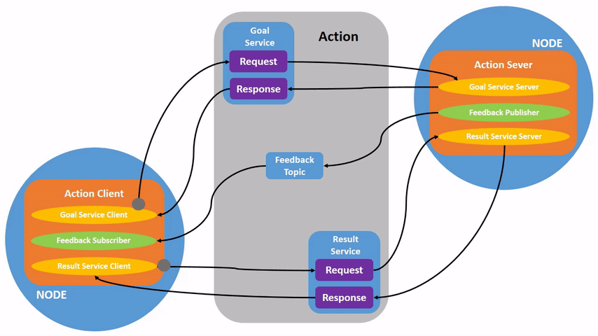

# Gazebo IK Server

This node receives a desired Cartesian position `(x, y, z)` through a ROS 2 service, solves inverse kinematics numerically, and then sends the resulting joint configuration to the Gazebo `joint_trajectory_controller`.


---

## 1. What this node does

The node performs four main tasks:

1. Receive a desired end-effector position through the `/ee_pose` service.
2. Compute the joint values `q` using numerical IK.
3. Send `q` to Gazebo through the `FollowJointTrajectory` action server.
4. Prevent new commands while a trajectory is still executing.

---

## 2. Main difference from the RViz version

In the RViz-only version, the IK solution was sent to:

```python
/q_cmd
```

using a `Float64MultiArray`.

In the Gazebo version, that is no longer enough, because Gazebo is controlled through `ros2_control`.

So instead of publishing directly to `/q_cmd`, the node now sends a trajectory goal to:

```python
/arm_controller/follow_joint_trajectory
```

This is the standard action interface used by `joint_trajectory_controller`.

---

## 3. New imports

The main new imports are:

```python
from rclpy.action import ActionClient
from control_msgs.action import FollowJointTrajectory
from trajectory_msgs.msg import JointTrajectoryPoint
```



### Why they are needed

- `ActionClient` lets the node communicate with an action server.
- `FollowJointTrajectory` is the action type used by the controller.
- `JointTrajectoryPoint` defines each trajectory waypoint.

---

## 4. Kinematics section

The first part of the file remains mostly unchanged:

- `dh_transform(...)`
- `fk_from_dh(...)`
- `fk_position_from_dh(...)`
- `jacobian_position_geometric_from_dh(...)`

These functions are still used to compute:

- forward kinematics,
- end-effector position,
- geometric Jacobian.

So the **mathematical core** of the IK solver did not change when moving to Gazebo.

---

## 5. Numerical IK section

The functions:

- `clamp(...)`
- `limit_step(...)`
- `ik_lm_position_dh(...)`

also remain conceptually the same.

This part still solves the inverse kinematics problem using a Levenberg-Marquardt style iterative method.

### Inputs

- desired Cartesian position
- initial guess
- DH table
- joint types
- joint limits

### Output

- `q_sol`: joint solution
- `ok`: whether convergence was successful
- `info`: iteration count, final error, damping value

So the IK algorithm itself is unchanged.

The big change happens **after** the solution is found.

---

## 6. Service server initialization

Inside `MoveToXYZServer.__init__()`, the service is created as before:

```python
self.server_ = self.create_service(
    EEpose,
    "ee_pose",
    self.ee_pose_callback
)
```

This means the node still waits for requests of the form:

- `x`
- `y`
- `z`

and returns:

- `success`
- `message`

---

## 7. Action client instead of `/q_cmd`

This is one of the most important modifications:

```python
self.trajectory_client_ = ActionClient(
    self,
    FollowJointTrajectory,
    "/arm_controller/follow_joint_trajectory"
)
```

### What changed?

Before:

- the node published joint values to `/q_cmd`

Now:

- the node sends a trajectory request to the controller


Gazebo is no longer being driven by a custom joint-state publisher.

Instead, the robot is driven by:

- `gz_ros2_control` [Docs](https://control.ros.org/kilted/doc/gz_ros2_control/doc/index.html)
- `joint_trajectory_controller` [Docs](https://control.ros.org/kilted/doc/ros2_controllers/joint_trajectory_controller/doc/userdoc.html)

So the IK node must send the motion command through the controller action interface.

---

## 8. Joint names

The node defines:

```python
self.joint_names_ = [
    "base_link_link_0_joint",
    "link_0_link_1_joint",
    "link_1_link_2_joint",
    "link_2_link_3_joint",
    "link_3_link_4_joint",
    "link_4_link_5_joint",
]
```

These names must match exactly:

1. the URDF joint names
2. the `ros2_control` block
3. the controller YAML file

If one name does not match, the controller will reject or ignore the trajectory.

---

## 9. Motion duration

The node defines:

```python
self.default_motion_time_ = 3.0
```

This is the time the robot will take to move from its current configuration to the IK solution.

### Practical meaning

- smaller value → faster motion
- larger value → slower motion

This is an easy way to demonstrate different motion speeds without changing the IK solver itself.

---

## 10. Preventing overlapping commands

The node now includes:

```python
self.motion_in_progress_ = False
```

This flag is used to prevent sending a second trajectory while one is already executing.

Without this flag, a student could call the service repeatedly before the first motion finishes.

That can cause:

- overlapping motion commands,
- confusing robot behavior,
- difficult debugging.

So this flag makes the node safer and easier to use in class.

---

## 11. Service callback logic

The service callback is still the main entry point:

```python
def ee_pose_callback(self, request, response):
```

1. Read `x`, `y`, `z`
2. Reject the request if a motion is already in progress
3. Solve IK
4. Validate the returned solution
5. Send the trajectory goal
6. Return the service response

---

## 12. New protection against overlapping requests

This part was added:

```python
if self.motion_in_progress_:
    response.success = False
    response.message = "A trajectory is already in progress. Wait until it finishes."
    return response
```

It prevents users from sending a new service request while the previous command is still being executed.

That keeps the service behavior predictable.

---

## 13. Sending the trajectory goal

After IK is solved, the service callback now does:

```python
ok = self.send_trajectory_goal(q_sol, self.default_motion_time_)
```

This replaces the old pattern:

```python
msg = Float64MultiArray()
msg.data = q_sol
self.q_cmd_pub_.publish(msg)
```

So the robot is no longer commanded through `/q_cmd`.

---

## 14. The `send_trajectory_goal()` method

This method packages the IK solution into a trajectory message.

### Step 1: validate size

```python
if len(q_target) != len(self.joint_names_):
```

This ensures the number of joint values matches the robot.

### Step 2: wait for the action server

```python
if not self.trajectory_client_.wait_for_server(timeout_sec=3.0):
```

This checks whether `/arm_controller/follow_joint_trajectory` is available.

### Step 3: create the goal

```python
goal_msg = FollowJointTrajectory.Goal()
goal_msg.trajectory.joint_names = self.joint_names_
```

### Step 4: create one trajectory point

```python
point = JointTrajectoryPoint()
point.positions = list(q_target)
```

### Step 5: set motion duration

```python
point.time_from_start.sec = int(duration_sec)
point.time_from_start.nanosec = int((duration_sec - int(duration_sec)) * 1e9)
```

This tells the controller how long it should take to reach the target.

### Step 6: append the point

```python
goal_msg.trajectory.points.append(point)
```

This creates a **single-point trajectory**.

---

## 15. Non-blocking action call


The node sends the goal **asynchronously**:

```python
send_goal_future = self.trajectory_client_.send_goal_async(goal_msg)
send_goal_future.add_done_callback(self.goal_response_callback)
```

and returns the service response immediately.

The service only needs to report:

- “IK solved and command sent”

It does **not** need to wait until the robot fully finishes moving.

That is a much better design for this application.

---

## 16. Marking the robot as busy

Before sending the goal, the code does:

```python
self.motion_in_progress_ = True
```

This is important because the robot is now executing a motion, and the service should reject new requests until that motion finishes.

---

## 17. Goal response callback

The method:

```python
def goal_response_callback(self, future):
```

is executed when the controller either accepts or rejects the goal.

### Cases

#### If no response is received
The node logs an error and clears the busy flag.

#### If the goal is rejected
The node logs an error and clears the busy flag.

#### If the goal is accepted
The node logs success and requests the result asynchronously:

```python
result_future = goal_handle.get_result_async()
result_future.add_done_callback(self.result_callback)
```

This keeps the whole process non-blocking.

---

## 18. Result callback

The method:

```python
def result_callback(self, future):
```

runs when the trajectory finishes.

### What it does

- prints the controller result
- clears the busy flag:

```python
self.motion_in_progress_ = False
```

This is what allows the next service request to be accepted.

So the busy flag is set:

- when motion starts

and cleared:

- when motion ends

---

## 19. `compute_ik()` method

This method is still responsible only for solving inverse kinematics.

### Steps
1. build desired position vector
2. call `ik_lm_position_dh(...)`
3. log the result
4. reject failed convergence
5. store the latest solution as the next initial guess

```python
self.q_last_ik_ = q_sol.copy()
```

Using the previous solution as the next initial guess usually improves convergence for nearby targets.

This is especially useful when the robot is moving between nearby points in a sequence.

---

## 20. Node execution

The usual ROS 2 structure remains:

```python
def main(args=None):
    rclpy.init(args=args)
    my_node = MoveToXYZServer()
    rclpy.spin(my_node)
    rclpy.shutdown()
```

So the node:

- initializes ROS 2
- creates the service/action node
- keeps spinning until interrupted

---
