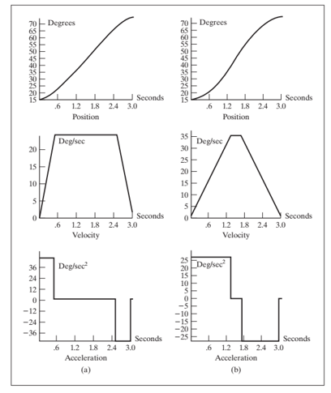
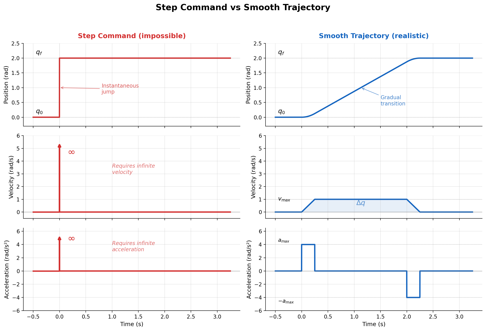
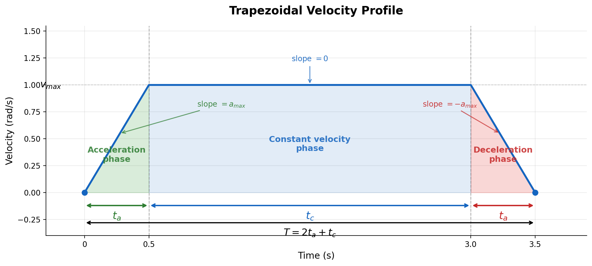
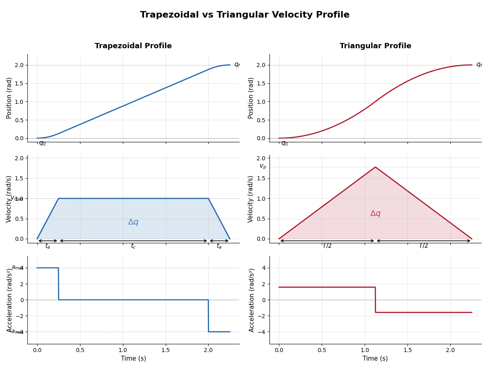
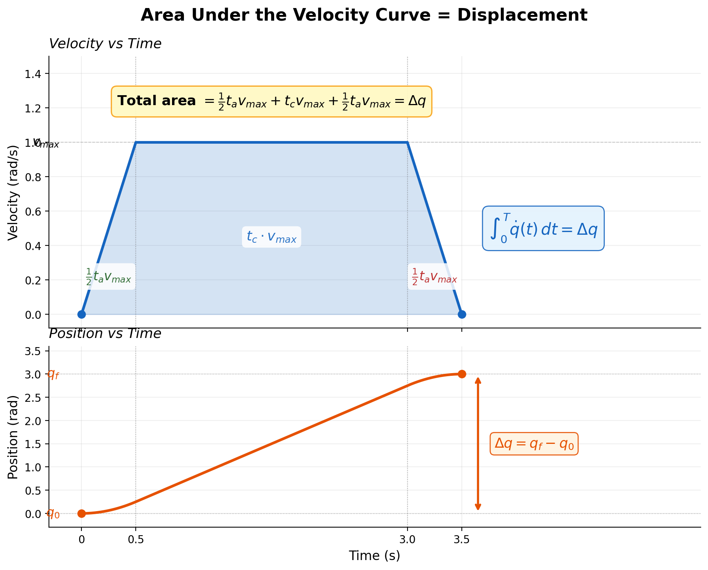
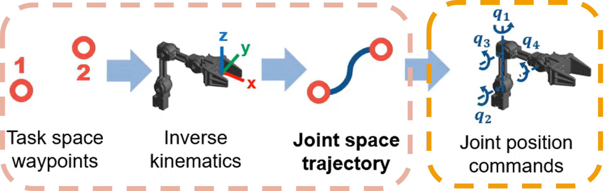
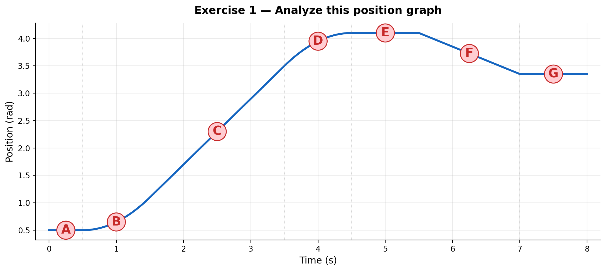
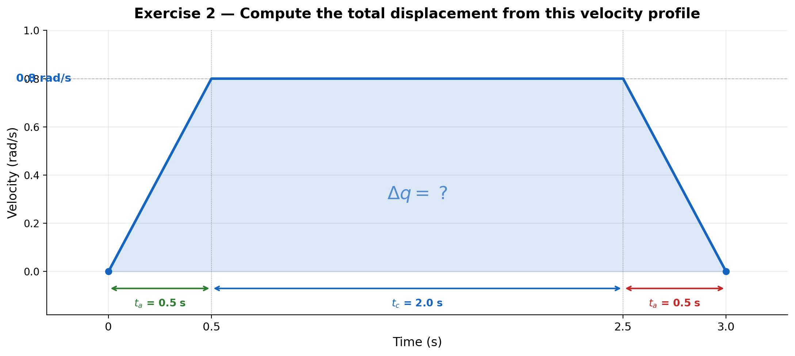
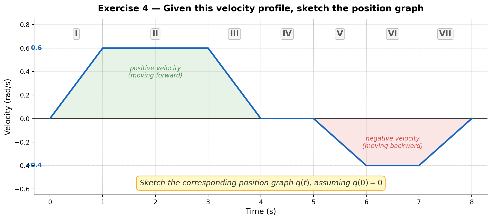

# Trajectory Planning I

## Speed, acceleration ramps, and joint-space trajectory profiles

---

# 1. Why trajectory planning matters

If we command a robot to jump instantly from one position to another, the request is mathematically simple but physically unrealistic.

A real actuator cannot:

- change position instantaneously,
- reach maximum speed instantly,
- stop instantly,
- ignore motor torque and inertia limits.

Because of that, every real motion must respect the relationship between:

- **position** $q(t)$
- **velocity** $\dot{q}(t)$
- **acceleration** $\ddot{q}(t)$

These are linked by calculus:

$$
\dot{q}(t) = \frac{dq(t)}{dt}
$$

$$
\ddot{q}(t) = \frac{d^2q(t)}{dt^2}
$$

and conversely,

$$
q(t) = q(0) + \int_0^t \dot{q}(\tau)\, d\tau
$$

$$
\dot{q}(t) = \dot{q}(0) + \int_0^t \ddot{q}(\tau)\, d\tau
$$

Trajectory planning is fundamentally the problem of designing a time evolution that respects these relationships.

---

# 2. The three graphs students must always read together

A robot trajectory is best understood with **three synchronized plots**:

1. **Position vs time**
2. **Velocity vs time**
3. **Acceleration vs time**

These should always be interpreted together, plotted on the same time axis.

## 2.1 Position graph

The position graph tells us **where the joint is** at each instant.

- A flat line means the robot is stopped.
- A positive slope means the robot is moving in the positive direction.
- A negative slope means the robot is moving in the negative direction.
- A steeper slope means greater speed.

---

## 2.2 Velocity graph

The velocity graph tells us **how fast the position is changing**.

- Positive velocity means motion in the positive direction.
- Zero velocity means the robot is stopped.
- Constant velocity means the position graph is a straight line.
- Increasing velocity means the position graph gets steeper.

---

## 2.3 Acceleration graph

The acceleration graph tells us **how quickly the velocity changes**.

- Positive acceleration increases speed.
- Negative acceleration reduces speed.
- Zero acceleration means constant speed.
- Very large acceleration means aggressive motion.

This graph is crucial because it relates directly to:

- motor torque demand,
- structural stress,
- vibration,
- wheel slip in mobile robots,
- loss of precision,
- wear and heating.

---

# 3. What is a ramp?

A **ramp** is a gradual increase or decrease in a variable over time.

In robot motion, the word is usually used for:

- **speed ramp**: velocity does not jump instantly; it rises progressively,
- **acceleration ramp**: acceleration itself is applied in a controlled way.

---

# 4. Ramps use

Without ramps, motion becomes abrupt. Abrupt motion causes:

- high torque spikes,
- mechanical shock,
- oscillations,
- tracking error,
- poor repeatability,
- possible controller saturation,
- discomfort in human-robot interaction,
- wheel slip in mobile robots,
- load swing or end-effector vibration in manipulators.

---

# 5. From position jump to realistic motion

Suppose we want a joint to move from $q_0$ to $q_f$.

The most naive command is simply:

$$
q(t) =
\begin{cases}
q_0, & t < 0 \\
q_f, & t \ge 0
\end{cases}
$$

This is a step in position, which implies:

- infinite velocity at the transition,
- undefined or impulsive acceleration,
- impossible physical execution.

So instead of a position step, we design a **trajectory**: a function $q(t)$ defined over a time interval $0 \le t \le T$, such that:

$$
q(0)=q_0,\qquad q(T)=q_f
$$

and usually also:

$$
\dot{q}(0)=0,\qquad \dot{q}(T)=0
$$

sometimes even:

$$
\ddot{q}(0)=0,\qquad \ddot{q}(T)=0
$$

depending on how smooth we want the motion to be.

---

# 6. Reading the relation between the three graphs

This is one of the most important conceptual blocks for students.

## Case A: constant velocity

If velocity is constant:

$$
\dot{q}(t)=v
$$

then position is linear:

$$
q(t)=q_0 + vt
$$

and acceleration is zero:

$$
\ddot{q}(t)=0
$$

Interpretation:

- velocity graph: horizontal line,
- position graph: straight line,
- acceleration graph: zero.

---

## Case B: constant acceleration

If acceleration is constant:

$$
\ddot{q}(t)=a
$$

then velocity is linear:

$$
\dot{q}(t)=\dot{q}_0 + at
$$

and position is quadratic:

$$
q(t)=q_0 + \dot{q}_0 t + \frac{1}{2}at^2
$$

Interpretation:

- acceleration graph: horizontal line,
- velocity graph: ramp,
- position graph: parabola.

---

# 7. Trapezoidal velocity

A very common robot motion profile is the **trapezoidal velocity profile**.

It has three stages:

1. **Acceleration phase** — velocity increases from 0 to $v_{max}$
2. **Constant velocity phase** — velocity remains at $v_{max}$
3. **Deceleration phase** — velocity decreases from $v_{max}$ to 0

This produces:

- a trapezoid in the velocity graph,
- piecewise constant acceleration,
- a smooth S-like position evolution made of quadratic and linear segments.

---

## 7.1 Mathematical description of the trapezoidal velocity profile

Assume:

- total displacement: $\Delta q = q_f - q_0$
- maximum velocity: $v_{max}$
- maximum acceleration: $a_{max}$

### Acceleration phase

From $t=0$ to $t=t_a$:

$$
\dot{q}(t)=a_{max}\, t
$$

with

$$
t_a = \frac{v_{max}}{a_{max}}
$$

Position during this phase:

$$
q(t)=q_0 + \frac{1}{2} a_{max}\, t^2
$$

Distance covered during acceleration:

$$
\Delta q_a = \frac{1}{2} a_{max}\, t_a^2 = \frac{v_{max}^2}{2\,a_{max}}
$$

### Constant velocity phase

From $t=t_a$ to $t=t_a+t_c$:

$$
\dot{q}(t)=v_{max}, \qquad \ddot{q}(t)=0
$$

Position grows linearly. Distance covered:

$$
\Delta q_c = v_{max}\, t_c
$$

### Deceleration phase

From $t=t_a+t_c$ to $t=T$:

$$
\dot{q}(t)=v_{max} - a_{max}(t-t_a-t_c)
$$

Distance covered during deceleration:

$$
\Delta q_d = \frac{v_{max}^2}{2\,a_{max}}
$$

### Total displacement

Since acceleration and deceleration are symmetric:

$$
\Delta q = \frac{v_{max}^2}{a_{max}} + v_{max}\, t_c
$$

From here, if $\Delta q$, $v_{max}$, and $a_{max}$ are known, we can solve for the cruise time:

$$
t_c = \frac{\Delta q - \frac{v_{max}^2}{a_{max}}}{v_{max}}
$$

An equivalent and more intuitive form is:

$$
t_c = \frac{\Delta q}{v_{max}} - t_a
$$

This second form reveals a clear physical meaning: the cruise time is the "ideal constant velocity time" minus the time spent ramping up. 

Total motion time:

$$
T = 2\,t_a + t_c
$$

---

# 8. When the trajectory is too short: triangular velocity profile

Sometimes the requested displacement is too short, so the robot does not have enough distance to accelerate up to $v_{max}$, stay at constant speed, then decelerate.

In that case, the profile becomes **triangular**: accelerate, then immediately decelerate, with no cruise phase.

Condition for triangular profile:

$$
\Delta q < \frac{v_{max}^2}{a_{max}}
$$

In this case, the peak velocity is less than $v_{max}$.

> Not every motion reaches the commanded maximum speed.
> Short motions are limited by distance, not only by velocity settings.

---

# 9. How to "read" a trajectory visually

### From the position graph

- Where does motion start and end?
- Where is the robot moving fastest?
- Where is it stopped?
- Is the motion smooth or abrupt?

### From the velocity graph

- When is the robot accelerating?
- When does it travel at constant speed?
- When does it reverse direction?
- Does it obey speed limits?

### From the acceleration graph

- Where are the high torque demands?
- Are acceleration changes abrupt?
- Is the robot likely to vibrate or jerk?

---

# 10. Why position, speed, and acceleration must be designed together

A common beginner mistake is to think:

> "I only care about position, so I will just command position."

But the controller still has to produce motion through time, so hidden inside every position command there is an implied velocity and acceleration demand.

Trajectory planning is not only about reaching the final point. It is also about how long the motion takes, how smooth it is, whether it respects actuator limits, and whether it is safe for the mechanism.

In robotics, a "good" trajectory is not merely one that arrives. It is one that arrives **smoothly, safely, and predictably**.

---

# 11. From speed profiles to trajectory generation

A trajectory can be generated from different starting points: boundary positions, boundary velocities, acceleration limits, or geometric paths plus timing laws.

For this first lecture, the most intuitive path is:

> Define a velocity profile first, then integrate it to obtain position.

---

# 12. Generating a trajectory from velocity

If we define a velocity function $\dot{q}(t)$, then the trajectory in position is obtained by integration:

$$
q(t)=q_0 + \int_0^t \dot{q}(\tau)\, d\tau
$$

This means:

- the **velocity profile** tells us how motion evolves,
- the **area under the velocity curve** gives displacement.

> The area under the velocity-time graph equals the change in position.

So if the robot must move by $\Delta q$, the chosen velocity profile must satisfy:

$$
\int_0^T \dot{q}(t)\,dt = \Delta q
$$

---

# 13. Example: trajectory generation from a triangular speed profile

Suppose a joint starts at $q_0$, accelerates linearly, then decelerates linearly, ending at $q_f$.

If the velocity graph is triangular, then the displacement is the area of the triangle:

$$
\Delta q = \frac{1}{2}\, T\, v_p
$$

where $T$ is total time and $v_p$ is peak speed. From this:

$$
v_p = \frac{2\,\Delta q}{T}
$$

---

# 14. Example: trajectory generation from a trapezoidal speed profile

If the velocity profile is trapezoidal, displacement is the area under the trapezoid:

$$
\Delta q = \frac{1}{2}\, t_a\, v_{max} + t_c\, v_{max} + \frac{1}{2}\, t_a\, v_{max}
$$

so:

$$
\Delta q = v_{max}(t_a + t_c)
$$

when acceleration and deceleration times are equal. 

---

# 15. What the controller receives vs what the robot does

In practice, a motion controller does not only need a destination. It often needs a time-parameterized trajectory, meaning it expects:

- desired joint positions at specific times,
- sometimes desired velocities,
- sometimes desired accelerations.

### The role of discrete time steps

Real industrial controllers do not evaluate the continuous integrals we have been writing. Instead, they run at a fixed control loop rate. For example, 100 Hz or 1000 Hz and update motor commands once per cycle.

This means that if the controller runs at frequency $f$, the time step between updates is:

$$
\Delta t = \frac{1}{f}
$$

Every continuous integral in our formulas is actually evaluated as a discrete sum inside the controller. For instance, the position update becomes:

$$
q_{k+1} = q_k + \dot{q}_k\, \Delta t
$$

where $k$ is the sample index.

This is important for two reasons: it determines how finely the trajectory is sampled, and it sets the resolution at which velocity and acceleration limits are enforced. $\Delta t$ will be one of the first parameters we must choose.

---

# 16. Path versus trajectory

### Path
The geometric route in space. Examples: a straight line in Cartesian space, a circular arc, a sequence of waypoints.

### Trajectory
The path plus time. Examples: where the robot should be at each instant, how fast it should move along the path, when it should accelerate and decelerate.

A robot can follow the same path with many different trajectories.

**Trajectory planning = path + timing law.**

---

# 17. Exercises

### Exercise 1
Given a position graph, identify: where velocity is zero, where velocity is maximum, and where acceleration is positive or negative.

### Exercise 2
Given a trapezoidal velocity graph, compute total displacement from the area under the curve.

### Exercise 3

Given $\Delta q$, $v_{max}$, and $a_{max}$, determine whether the motion is trapezoidal or triangular.

a) $\Delta q = 5$ rad, $v_{max} = 2$ rad/s, $a_{max} = 4$ rad/s²

b) $\Delta q = 0.4$ rad, $v_{max} = 2$ rad/s, $a_{max} = 4$ rad/s²

### Exercise 4

Sketch the position graph corresponding to a given velocity graph.

### Exercise 5

A joint must move $\Delta q = 2$ rad with $v_{max} = 1$ rad/s and $a_{max} = 4$ rad/s².

a) Determine whether the motion is trapezoidal or triangular.

b) Compute $t_a$, $t_c$, and $T$.

c) Write the velocity function $\dot{q}(t)$ for each phase.

d) Write the position function $q(t)$ for each phase, assuming $q_0 = 0$.

### Exercise 6

A joint must move Δq = 3 rad in exactly T = 3 s.

a) Design a **triangular** velocity profile for this motion.
   Compute the peak velocity v_p and the required acceleration a.

b) Design a **trapezoidal** velocity profile with acceleration
   time t_a = 0.5 s. Compute v_max and a_max.

c) Compare the peak acceleration of both profiles.
   Which profile is gentler on the motor? Why?
   
---

