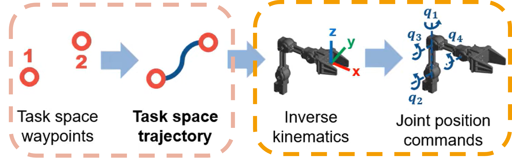

# Trajectory Planning II: Linear Cartesian Trajectories

## 21. From joint motion to Cartesian motion

In Lecture 1, we discussed trajectory generation from the point of view of a single joint variable $q(t)$. That is the most direct way to understand ramps, velocity profiles, and acceleration limits.

However, in many practical tasks we do not want to say "joint 1 must move by this angle." Instead, we want to say:

- "the end-effector must move in a straight line,"
- "the tool must go from point A to point B at a controlled linear speed."

This is called a **linear Cartesian trajectory**: the end-effector position follows a straight segment in task space.

{width=80%}

---

## 22. What "linear trajectory" means

Suppose the end-effector must move from an initial point

$$
\mathbf{p}_0 =
\begin{bmatrix}
x_0\\y_0\\z_0
\end{bmatrix}
$$

to a final point

$$
\mathbf{p}_f =
\begin{bmatrix}
x_f\\y_f\\z_f
\end{bmatrix}
$$

A linear trajectory in Cartesian space means the tool position remains on the straight line connecting these two points.

Using a scalar path parameter $s \in [0, 1]$:

$$
\mathbf{p}(s)=\mathbf{p}_0 + s(\mathbf{p}_f-\mathbf{p}_0)
$$

This defines the **geometry of the path**, but not yet the timing.

---

## 23. Adding timing: from path to trajectory

To transform the geometric line into an actual trajectory, we define:

$$
s = s(t)
$$

Then the Cartesian trajectory becomes:

$$
\mathbf{p}(t)=\mathbf{p}_0 + s(t)(\mathbf{p}_f-\mathbf{p}_0)
$$

So the problem becomes: how fast should the robot move along the line, how should it accelerate, and when should it stop.

Recall from Lecture 1: **trajectory = path + timing law.**

---

## 24. Geometric setup: direction and distance

Before choosing any speed profile, we extract the two geometric quantities that define the straight-line path.

### 24.1 Path length

The total distance the end-effector must travel is:

$$
L = \|\mathbf{p}_f - \mathbf{p}_0\|
= \sqrt{(x_f - x_0)^2 + (y_f - y_0)^2 + (z_f - z_0)^2}
$$

### 24.2 Unit direction vector

The direction from start to finish, normalized to unit length:

$$
\hat{\mathbf{u}} = \frac{\mathbf{p}_f - \mathbf{p}_0}{L}
$$

This vector tells us *which way* the end-effector moves; its magnitude is always 1.  This vector tells you that for every meter traveled, the end-effector moves in equal parts x y z.

### 24.3 Python — computing path geometry

```python
import numpy as np

p0 = np.array([1.5, 0.5])   # start point [m]
pf = np.array([1.0, 1.0])   # end point   [m]

delta = pf - p0              # displacement vector
L = np.linalg.norm(delta)    # path length
u_hat = delta / L            # unit direction

print(f"Displacement : {delta}")
print(f"Path length L: {L:.4f} m")
print(f"Unit vector  : {u_hat}")
```

```
Displacement : [-0.5  0.5]
Path length L: 0.7071 m
Unit vector  : [-0.7071  0.7071]
```

For example if the robot moves at 1 m/s along this line, it will move at -0.7071 m/s in x and +0.7071 m/s in y.

---

## 25. Distance traveled along the line

With the geometric setup in place, we parameterize *how far* the end-effector has progressed along the line at time $t$.

Define $\lambda(t)$ as the **arc-length traveled** along the straight line:

$$
0 \le \lambda(t) \le L
$$

Then the Cartesian position at any instant is:

$$
\mathbf{p}(t) = \mathbf{p}_0 + \lambda(t)\,\hat{\mathbf{u}}
$$

The relationship to the normalized parameter $s(t)$ from section 23 is:

$$
\lambda(t) = s(t) \cdot L
\qquad \Longleftrightarrow \qquad
s(t) = \frac{\lambda(t)}{L}
$$

---

## 26. Scalar speed along the line

The rate of change of the distance traveled defines the **linear speed** along the path:

$$
v(t) = \dot{\lambda}(t)
$$

Since $\lambda(t)$ starts at 0 and ends at $L$, we can recover it by integration:

$$
\lambda(t) = \int_0^t v(\tau)\,d\tau
$$

Substituting back into the position equation:

$$
\mathbf{p}(t) = \mathbf{p}_0 + \left(\int_0^t v(\tau)\,d\tau\right) \hat{\mathbf{u}}
$$

> **Key idea:** once the straight line is defined by $\mathbf{p}_0$ and $\hat{\mathbf{u}}$, the entire Cartesian trajectory is determined by a single scalar function $v(t)$.

This means we can apply any of the speed profiles from Lecture 1 (constant, trapezoidal, S-curve) directly to $v(t)$, and the end-effector will follow the line with that speed law.

---

### 26.1 Constant linear speed

The simplest case is constant speed $v(t) = v$:

$$
\lambda(t) = v\,t, \qquad \mathbf{p}(t) = \mathbf{p}_0 + v\,t\,\hat{\mathbf{u}}
$$

Total time: $T = L / v$.

This is mathematically simple but physically incomplete, because it assumes the robot can instantly start and stop at speed $v$. Just as in joint-space motion, we usually prefer **speed ramps**.

---

### 26.2 Trapezoidal linear speed profile

Instead of commanding a constant speed immediately, we define a trapezoidal scalar speed profile with maximum speed $v_{\max}$ and maximum acceleration $a_{\max}$:

1. **Acceleration phase** ($0 \le t \le t_a$): the end-effector accelerates along the line.
2. **Cruise phase** ($t_a < t \le t_a + t_c$): constant linear speed $v_{\max}$.
3. **Deceleration phase**: the end-effector decelerates to rest before reaching $\mathbf{p}_f$.

The acceleration time is:

$$
t_a = \frac{v_{\max}}{a_{\max}}
$$

The distance covered during acceleration and deceleration (symmetric):

$$
d_a = \frac{1}{2}\,a_{\max}\,t_a^2 = \frac{v_{\max}^2}{2\,a_{\max}}
$$

The remaining distance at cruise speed:

$$
d_c = L - 2\,d_a
$$

**Trapezoidal vs. triangular check:** if $d_c > 0$ the profile is trapezoidal. If $d_c \le 0$, the robot cannot reach $v_{\max}$ and the profile becomes triangular (see Lecture 1).

Cruise time and total time (trapezoidal case):

$$
t_c = \frac{d_c}{v_{\max}}, \qquad T = 2\,t_a + t_c
$$

The straight-line geometry remains the same regardless of the speed profile — what changes is only how fast the robot progresses along that line. All the math from Lecture 1 applies directly; the only difference is that now $v(t)$ is a scalar speed along a Cartesian line instead of a joint velocity.

### 26.3 Python — trapezoidal speed profile for a Cartesian line

```python
import numpy as np

# --- Path geometry (from section 24) ---
p0 = np.array([1.5, 0.5])
pf = np.array([1.0, 1.0])
delta = pf - p0
L = np.linalg.norm(delta)
u_hat = delta / L

# --- Speed-profile parameters ---
v_max = 0.1    # m/s
a_max = 0.2    # m/s²

# --- Acceleration phase ---
t_a = v_max / a_max
d_a = 0.5 * a_max * t_a**2            # distance during accel

# --- Trapezoidal / triangular check ---
d_c = L - 2 * d_a
if d_c > 0:
    profile = "trapezoidal"
    t_c = d_c / v_max
else:
    profile = "triangular"
    # Recompute t_a for triangular profile
    t_a = np.sqrt(L / a_max)
    v_peak = a_max * t_a
    t_c = 0.0
    d_c = 0.0

T = 2 * t_a + t_c

print(f"Profile type : {profile}")
print(f"t_a          : {t_a:.4f} s")
print(f"t_c          : {t_c:.4f} s")
print(f"T (total)    : {T:.4f} s")
```

```
Profile type : trapezoidal
t_a          : 0.5000 s
t_c          : 6.5711 s
T (total)    : 7.5711 s
```

---

## 27. Cartesian velocity along a line

Differentiating the position equation:

$$
\dot{\mathbf{p}}(t) = \dot{\lambda}(t)\,\hat{\mathbf{u}} = v(t)\,\hat{\mathbf{u}}
$$

> The Cartesian velocity vector is the scalar linear speed multiplied by the direction of the line.

Once the direction is known, changing the speed profile only scales the velocity vector. If the line direction is fixed, then the Cartesian velocity always points along that line — only its magnitude changes.

---

## 28. Straight in Cartesian ≠ straight in joint space

Before we convert Cartesian velocities into joint velocities, it is important to understand *why* this conversion is non-trivial.

The straight line in Cartesian space is simple for humans to understand: move from A to B in a line. But the corresponding joint motion is usually **not linear**.

> A linear Cartesian trajectory generally does not produce a linear joint trajectory.

Even if the end-effector moves in a perfect straight line at constant speed, each joint may speed up, slow down, or reverse curvature. This happens because the mapping between joint space and Cartesian space (forward kinematics) is nonlinear — it involves sines and cosines of the joint angles.

This is why the Jacobian changes along the motion and must be updated at every time step.

<div style="width: 80%; margin: 0 auto;">
  <table style="width: 100%; border-collapse: collapse; text-align: center;">
    <tr>
      <td style="width: 50%; padding: 10px;"></td>
      <td style="width: 50%; padding: 10px;"></td>
    </tr>
    <tr>
      <td style="padding: 10px;"></td>
      <td style="padding: 10px;"></td>
    </tr>
    <tr>
      <td style="padding: 10px;"></td>
      <td style="padding: 10px;"></td>
    </tr>
    <tr>
      <td style="padding: 10px;"></td>
      <td style="padding: 10px;"></td>
    </tr>
  </table>
</div>

---

## 29. Converting Cartesian velocity to joint velocity

From the Differential Kinematics topic, we know that the Jacobian maps joint velocities to Cartesian velocities:

$$
\dot{\mathbf{p}} = J_v(\mathbf{q})\,\dot{\mathbf{q}}
$$

and that jpint velocities can be obtained from Cartesian velocities by inverting the Jacobian:

$$
\dot{\mathbf{q}} = J_v^{-1}(\mathbf{q})\,\dot{\mathbf{p}}
\qquad \text{or} \qquad
\dot{\mathbf{q}} = J_v^{+}(\mathbf{q})\,\dot{\mathbf{p}}
$$

For a linear Cartesian trajectory, the input $\dot{\mathbf{p}} = J_v(\mathbf{q})\,\dot{\mathbf{q}}$ is exactly the kind of desired Cartesian velocity that inverse velocity kinematics expects. We apply it at every time step, recomputing the Jacobian each time because it depends on the current configuration.

### 29.1 Python — computing joint velocities from Cartesian velocity

```python
import numpy as np

def jacobian_2dof(q, l1=1.0, l2=1.0):
    """Linear velocity Jacobian for a planar 2-DOF robot."""
    q1, q2 = q
    s1  = np.sin(q1)
    c1  = np.cos(q1)
    s12 = np.sin(q1 + q2)
    c12 = np.cos(q1 + q2)
    return np.array([
        [-l1*s1 - l2*s12,  -l2*s12],
        [ l1*c1 + l2*c12,   l2*c12]
    ])

# Example configuration
q = np.array([0.3, 0.8])   # rad

# Desired Cartesian velocity (constant speed along the line)
v = 0.1
u_hat = np.array([-0.7071, 0.7071])
p_dot = v * u_hat           # [-0.0707, 0.0707] m/s

# Compute Jacobian and joint velocities
Jv = jacobian_2dof(q)
q_dot = np.linalg.solve(Jv, p_dot)   # J^{-1} * p_dot

print(f"Jacobian:\n{Jv}")
print(f"Desired p_dot: {p_dot}")
print(f"Joint velocities q_dot: {q_dot} rad/s")
```

> **Note on `np.linalg.solve` vs `np.linalg.inv`:** for a square, non-singular system, `np.linalg.solve(A, b)` computes $A^{-1}b$ more efficiently and more numerically stable than `np.linalg.inv(A) @ b`. For non-square or singular systems, use `np.linalg.pinv(Jv) @ p_dot` instead.


```
Jacobian:
[[-1.18672757 -0.89120736]
 [ 1.40893261  0.45359612]]
Desired p_dot: [-0.07071  0.07071]
Joint velocities q_dot: [0.04313547 0.02190282] rad/s
```

---

## 30. Full procedure for linear trajectory generation

### Step 1. Define the initial and final Cartesian points

$$
\mathbf{p}_0,\quad \mathbf{p}_f
$$

### Step 2. Compute the line direction and path length

$$
L=\|\mathbf{p}_f-\mathbf{p}_0\|, \qquad \hat{\mathbf{u}}=\frac{\mathbf{p}_f-\mathbf{p}_0}{L}
$$

### Step 3. Choose a scalar speed law along the path

For example, a trapezoidal profile $v(t)$ with chosen $v_{\max}$ and $a_{\max}$.

### Step 4. Compute the desired Cartesian velocity at each time step

$$
\dot{\mathbf{p}}(t)=v(t)\,\hat{\mathbf{u}}
$$

### Step 5. Convert Cartesian velocity into joint velocity

$$
\dot{\mathbf{q}}(t)=J_v^{-1}(\mathbf{q})\,\dot{\mathbf{p}}(t)
\qquad \text{or} \qquad
\dot{\mathbf{q}}(t)=J_v^{+}(\mathbf{q})\,\dot{\mathbf{p}}(t)
$$

### Step 6. Integrate joint velocity to obtain joint trajectory

$$
\mathbf{q}_{k+1}=\mathbf{q}_k+\dot{\mathbf{q}}_k\,\Delta t
$$

### Step 7. Verify the Cartesian path with forward kinematics

At each instant, use forward kinematics to check whether the end-effector remains close to the desired line.

---

## 31. Worked numerical example

Consider a planar 2-DOF robot with link lengths $l_1 = l_2 = 1$ m. We build the Jacobian using the **geometric method**: for each revolute joint $i$, the corresponding column of the linear velocity Jacobian is:

$$
\mathbf{j}_i = \mathbf{z}_i \times (\mathbf{p}_e - \mathbf{p}_i)
$$

where $\mathbf{z}_i = (0, 0, 1)$ is the joint axis, $\mathbf{p}_i$ is the position of joint $i$, and $\mathbf{p}_e$ is the end-effector position. Since we work in 2D, we keep only the $x$ and $y$ components of each cross product.

**Setup:**

- Start: $\mathbf{p}_0 = (1.5,\; 0.5)$ m
- End: $\mathbf{p}_f = (1.0,\; 1.0)$ m
- Linear speed: constant at $v = 0.1$ m/s (simplified, no ramp for this example)
- Control loop: $\Delta t = 0.01$ s (100 Hz)

### Step 1. Path geometry

$$
\mathbf{p}_f - \mathbf{p}_0 = (-0.5,\; 0.5)
$$

$$
L = \sqrt{(-0.5)^2 + (0.5)^2} = \sqrt{0.5} \approx 0.7071 \text{ m}
$$

$$
\hat{\mathbf{u}} = \frac{1}{0.7071}(-0.5,\; 0.5) = (-0.7071,\; 0.7071)
$$

### Step 2. Desired Cartesian velocity (constant speed)

$$
\dot{\mathbf{p}} = v \cdot \hat{\mathbf{u}} = 0.1 \times (-0.7071,\; 0.7071) = (-0.0707,\; 0.0707) \text{ m/s}
$$

### Step 3. First iteration — building the geometric Jacobian

Suppose inverse kinematics gives the initial configuration $q_1 = 0.3$, $q_2 = 0.8$ rad.

**Compute joint and end-effector positions:**

$$
\mathbf{p}_1 = (0, \; 0, \; 0) \qquad \text{(base, joint 1)}
$$

$$
\mathbf{p}_2 = (l_1 \cos q_1, \; l_1 \sin q_1, \; 0) = (\cos 0.3, \; \sin 0.3, \; 0) = (0.9553, \; 0.2955, \; 0) \qquad \text{(joint 2)}
$$

$$
\mathbf{p}_e = (l_1 \cos q_1 + l_2 \cos(q_1+q_2), \; l_1 \sin q_1 + l_2 \sin(q_1+q_2), \; 0)
$$

$$
= (0.9553 + 0.4536, \; 0.2955 + 0.8912, \; 0) = (1.4089, \; 1.1867, \; 0)
$$

**Column 1:** $\mathbf{z}_1 \times (\mathbf{p}_e - \mathbf{p}_1)$

$$
\mathbf{p}_e - \mathbf{p}_1 = (1.4089, \; 1.1867, \; 0)
$$

$$
\mathbf{z} \times (\mathbf{p}_e - \mathbf{p}_1) =
\begin{vmatrix}
\mathbf{i} & \mathbf{j} & \mathbf{k} \\
0 & 0 & 1 \\
1.4089 & 1.1867 & 0
\end{vmatrix}
= (-1.1867, \; 1.4089, \; 0)
$$

Keep $x, y$: $\mathbf{j}_1 = (-1.1867, \; 1.4089)$

**Column 2:** $\mathbf{z}_2 \times (\mathbf{p}_e - \mathbf{p}_2)$

$$
\mathbf{p}_e - \mathbf{p}_2 = (1.4089 - 0.9553, \; 1.1867 - 0.2955, \; 0) = (0.4536, \; 0.8912, \; 0)
$$

$$
\mathbf{z} \times (\mathbf{p}_e - \mathbf{p}_2) =
\begin{vmatrix}
\mathbf{i} & \mathbf{j} & \mathbf{k} \\
0 & 0 & 1 \\
0.4536 & 0.8912 & 0
\end{vmatrix}
= (-0.8912, \; 0.4536, \; 0)
$$

Keep $x, y$: $\mathbf{j}_2 = (-0.8912, \; 0.4536)$

**Assemble the Jacobian:**

$$
J_v = \begin{bmatrix} \mathbf{j}_1 & \mathbf{j}_2 \end{bmatrix}
= \begin{bmatrix}
-1.1867 & -0.8912 \\
1.4089 & 0.4536
\end{bmatrix}
$$

### Step 4. Invert the Jacobian

Compute the determinant:

$$
\det(J_v) = (-1.1867)(0.4536) - (-0.8912)(1.4089) = -0.5383 + 1.2555 = 0.7172
$$

The determinant is nonzero, so the Jacobian is invertible. Using the $2 \times 2$ inverse formula:

$$
J_v^{-1} = \frac{1}{0.7172}
\begin{bmatrix}
0.4536 & 0.8912 \\
-1.4089 & -1.1867
\end{bmatrix}
= \begin{bmatrix}
0.6325 & 1.2427 \\
-1.9645 & -1.6547
\end{bmatrix}
$$

### Step 5. Compute joint velocities

$$
\dot{\mathbf{q}}_0 = J_v^{-1} \dot{\mathbf{p}}
= \begin{bmatrix}
0.6325 & 1.2427 \\
-1.9645 & -1.6547
\end{bmatrix}
\begin{bmatrix}
-0.0707 \\
0.0707
\end{bmatrix}
$$

$$
\dot{q}_1 = (0.6325)(-0.0707) + (1.2427)(0.0707) = -0.0447 + 0.0879 = 0.0431 \text{ rad/s}
$$

$$
\dot{q}_2 = (-1.9645)(-0.0707) + (-1.6547)(0.0707) = 0.1389 - 0.1170 = 0.0219 \text{ rad/s}
$$

### Step 6. Update joint positions

$$
\mathbf{q}_1 = \mathbf{q}_0 + \dot{\mathbf{q}}_0 \, \Delta t
= \begin{bmatrix} 0.3 \\ 0.8 \end{bmatrix}
+ \begin{bmatrix} 0.0431 \\ 0.0219 \end{bmatrix} \times 0.01
= \begin{bmatrix} 0.3004 \\ 0.8002 \end{bmatrix}
$$

### Step 7. Verify with forward kinematics

$$
x = \cos(0.3004) + \cos(1.1006), \qquad y = \sin(0.3004) + \sin(1.1006)
$$

This should be very close to $(1.4993,\; 0.5007)$.

### Step 8. Repeat

Recompute joint positions $\mathbf{p}_1$, $\mathbf{p}_2$, $\mathbf{p}_e$ at the new configuration, rebuild the Jacobian via cross products, invert, and continue. **Even though the Cartesian velocity is constant, the joint velocities change at every step** because the joint positions — and therefore the Jacobian columns — depend on the current configuration.

---

### 31.1 Python — full trajectory loop

```python
import numpy as np

# =====================================================================
# Robot model — geometric Jacobian
# =====================================================================
def forward_kinematics(q, l1=1.0, l2=1.0):
    """End-effector position for a planar 2-DOF robot."""
    x = l1 * np.cos(q[0]) + l2 * np.cos(q[0] + q[1])
    y = l1 * np.sin(q[0]) + l2 * np.sin(q[0] + q[1])
    return np.array([x, y])

def jacobian_2dof_geometric(q, l1=1.0, l2=1.0):
    """Linear velocity Jacobian using the geometric method.

    For each revolute joint i:
        J_v column i = z_i × (p_e - p_i)
    where z_i = [0, 0, 1] is the joint axis.
    We keep only x and y components of the cross product.
    """
    # Joint positions (in 3D for cross product)
    p0 = np.array([0.0, 0.0, 0.0])
    p1 = np.array([l1 * np.cos(q[0]), l1 * np.sin(q[0]), 0.0])

    # End-effector position
    pe = np.array([
        l1 * np.cos(q[0]) + l2 * np.cos(q[0] + q[1]),
        l1 * np.sin(q[0]) + l2 * np.sin(q[0] + q[1]),
        0.0
    ])

    # Joint axis (same for both revolute joints)
    z = np.array([0.0, 0.0, 1.0])

    # Jacobian columns: z × (pe - pi), keep x and y
    col1 = np.cross(z, pe - p0)[:2]
    col2 = np.cross(z, pe - p1)[:2]

    return np.column_stack([col1, col2])

def inverse_kinematics_2dof(p, l1=1.0, l2=1.0, elbow_up=True):
    """Analytic inverse kinematics for a planar 2-DOF robot."""
    x, y = p
    c2 = (x**2 + y**2 - l1**2 - l2**2) / (2 * l1 * l2)
    c2 = np.clip(c2, -1.0, 1.0)
    s2 = np.sqrt(1 - c2**2) if elbow_up else -np.sqrt(1 - c2**2)
    q2 = np.arctan2(s2, c2)
    q1 = np.arctan2(y, x) - np.arctan2(l2 * s2, l1 + l2 * c2)
    return np.array([q1, q2])

# =====================================================================
# Trajectory parameters
# =====================================================================
p0 = np.array([1.5, 0.5])
pf = np.array([1.0, 1.0])

delta = pf - p0
L     = np.linalg.norm(delta)
u_hat = delta / L

v_lin = 0.1     # constant linear speed [m/s]
dt    = 0.01    # control period [s]
T     = L / v_lin
N     = int(np.ceil(T / dt))

# =====================================================================
# Initial joint configuration (via inverse kinematics)
# =====================================================================
q = inverse_kinematics_2dof(p0)
print(f"Initial q: {q} rad")
print(f"FK check : {forward_kinematics(q)}  (should be ≈ {p0})")

# =====================================================================
# Main trajectory loop
# =====================================================================
q_traj    = np.zeros((N + 1, 2))
p_traj    = np.zeros((N + 1, 2))
qdot_traj = np.zeros((N, 2))

q_traj[0] = q
p_traj[0] = forward_kinematics(q)

p_dot = v_lin * u_hat               # constant Cartesian velocity

for k in range(N):
    # 1. Geometric Jacobian at current configuration
    Jv = jacobian_2dof_geometric(q_traj[k])

    # 2. Joint velocity via inverse velocity kinematics
    q_dot_k = np.linalg.solve(Jv, p_dot)
    qdot_traj[k] = q_dot_k

    # 3. Integrate: update joint positions
    q_traj[k + 1] = q_traj[k] + q_dot_k * dt

    # 4. Forward kinematics for verification
    p_traj[k + 1] = forward_kinematics(q_traj[k + 1])

# =====================================================================
# Results
# =====================================================================
print(f"\nFinal joint angles : {q_traj[-1]} rad")
print(f"Final EE position  : {p_traj[-1]}")
print(f"Desired final pos  : {pf}")
print(f"Position error     : {np.linalg.norm(p_traj[-1] - pf):.6f} m")
```

### 31.2 Python — trapezoidal speed version

To use a trapezoidal speed profile instead of constant speed, replace the constant `p_dot` inside the loop:

```python
def trapezoidal_speed(t, t_a, t_c, v_max, a_max):
    """Scalar speed v(t) for a trapezoidal profile."""
    T = 2 * t_a + t_c
    if t < 0:
        return 0.0
    elif t < t_a:
        return a_max * t
    elif t < t_a + t_c:
        return v_max
    elif t < T:
        return v_max - a_max * (t - t_a - t_c)
    else:
        return 0.0

# Inside the loop, replace the constant p_dot with:
for k in range(N):
    t_k = k * dt
    v_k = trapezoidal_speed(t_k, t_a, t_c, v_max, a_max)
    p_dot_k = v_k * u_hat              # <-- time-varying Cartesian velocity

    Jv = jacobian_2dof_geometric(q_traj[k])
    q_dot_k = np.linalg.solve(Jv, p_dot_k)
    qdot_traj[k] = q_dot_k
    q_traj[k + 1] = q_traj[k] + q_dot_k * dt
    p_traj[k + 1] = forward_kinematics(q_traj[k + 1])
```

---

## 32. The velocity-based approach: what it means

We are not solving inverse kinematics for each point along the line. Instead, we are continuously updating the joints so that the end-effector velocity follows the desired Cartesian velocity.

This is a **velocity-based trajectory generation approach**:

- generate a desired Cartesian velocity at every instant,
- convert it to joint velocity at every instant,
- integrate the result through time.

---

## 33. Main limitations

### 33.1 Singularity risk
If the Jacobian becomes singular or near-singular, the required joint velocities may become very large.

**Physical example:** if the robot tries to move in a straight line that passes directly through or near its own base axis, or if the arm is fully extended, the required joint velocities to maintain a given linear speed will approach infinity. The math blows up because the mechanism physically cannot produce that Cartesian motion from that configuration.

**Practical check in code:**

```python
det_J = np.linalg.det(Jv)
if abs(det_J) < 1e-6:
    print("WARNING: near-singular Jacobian, det =", det_J)
    # Reduce speed, stop, or use damped pseudoinverse
```

### 33.2 Joint limits
Even if the Cartesian path is valid, the required joint motion may violate joint position limits, velocity limits, or acceleration limits.

```python
Q_MIN = np.array([-np.pi, -np.pi])
Q_MAX = np.array([ np.pi,  np.pi])
QDOT_MAX = np.array([2.0, 2.0])       # rad/s

# After computing q_dot and q_next:
if np.any(q_next < Q_MIN) or np.any(q_next > Q_MAX):
    print("WARNING: joint position limit violated")

if np.any(np.abs(q_dot) > QDOT_MAX):
    print("WARNING: joint velocity limit violated")
```

### 33.3 Numerical drift
If joint velocities are integrated numerically, accumulated error may cause deviation from the desired path over time. The standard practical fix is to periodically correct the integrated joint position against the desired Cartesian position using inverse position kinematics. This prevents small errors from accumulating into visible path deviation.

```python
# Periodically (e.g. every 100 steps):
if k % 100 == 0 and k > 0:
    p_desired_k = p0 + lam_array[k] * u_hat
    p_actual_k  = forward_kinematics(q_traj[k])
    error = np.linalg.norm(p_desired_k - p_actual_k)
    if error > 1e-4:
        # Recompute joint angles from desired Cartesian position
        q_traj[k] = inverse_kinematics_2dof(p_desired_k)
```

### 33.4 Orientation not yet controlled
If we only use the linear Jacobian $J_v$, then we control only end-effector position, not orientation. This is acceptable as a first step, but later the full spatial velocity (linear + angular) should be considered using the full $6 \times n$ Jacobian.

---

## 37. Exercises 

### Exercise 6
Given $\mathbf{p}_0 = (0.8,\; 0.2)$ m and $\mathbf{p}_f = (0.4,\; 0.6)$ m, compute the path length $L$ and the unit direction vector $\hat{\mathbf{u}}$.

### Exercise 7
For the path from Exercise 6, assign a trapezoidal scalar speed profile with $v_{\max} = 0.05$ m/s and $a_{\max} = 0.1$ m/s². Determine whether the profile is trapezoidal or triangular. Compute $t_a$, $t_c$, and $T$.

### Exercise 8

Consider a planar 2-DOF robot with $l_1 = l_2 = 1$ m at configuration $q_1 = 0.5$, $q_2 = 1.0$ rad. The desired Cartesian velocity is $\dot{\mathbf{p}} = (-0.035,\; 0.035)$ m/s.

**Part a.** Compute the joint positions $\mathbf{p}_1$, $\mathbf{p}_2$ and end-effector position $\mathbf{p}_e$.

**Part b.** Build the geometric Jacobian using $\mathbf{j}_i = \mathbf{z}_i \times (\mathbf{p}_e - \mathbf{p}_i)$, keeping only the $x$ and $y$ components.

**Part c.** Compute the determinant of $J_v$ and verify it is non-singular.

**Part d.** Compute $J_v^{-1}$ using the $2 \times 2$ inverse formula.

**Part e.** Compute the required joint velocities $\dot{\mathbf{q}}_k = J_v^{-1}\,\dot{\mathbf{p}}$.

**Part f.** Verify your result by checking that $J_v \, \dot{\mathbf{q}}_k = \dot{\mathbf{p}}$.

### Exercise 9
If the Cartesian speed is doubled from $v$ to $2v$ along the same line, what happens to the required joint velocities? What happens to the total trajectory time? Justify mathematically.

### Exercise 10
Explain in your own words why a straight-line Cartesian trajectory produces nonlinear joint trajectories, even when the Cartesian speed is constant.


### Exercise 11
Using the code from section 31.1 as a starting point, modify it to explore the following three scenarios. For each one, plot the end-effector path in the $xy$-plane, joint angles over time, and joint velocities over time.

**Scenario A.** Change the endpoints to $\mathbf{p}_0 = (1.0,\; 0.2)$ and $\mathbf{p}_f = (0.5,\; 1.2)$. Does the end-effector still follow a straight line?

**Scenario B.** Replace the constant speed with a trapezoidal profile using $v_{\max} = 0.1$ m/s and $a_{\max} = 0.2$ m/s² (use the code from section 31.2). Compare the joint velocity plots against the constant-speed case.

**Scenario C.** Use the original endpoints but set $\mathbf{p}_f = (1.95,\; 0.1)$, which brings the arm close to full extension. Monitor the determinant of the Jacobian at each step and observe what happens to the joint velocities. At what point does the motion become problematic?