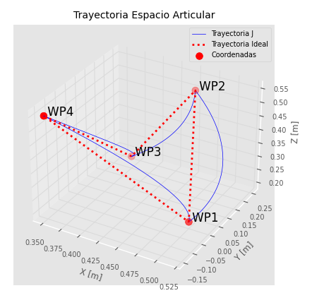
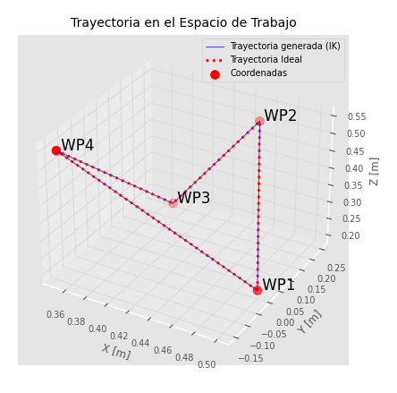

# Trajectory Planning I: Linear Cartesian Trajectories

## Linear Cartesian trajectory generation

---

# 21. From joint motion to Cartesian motion

In Lecture 1, we discussed trajectory generation from the point of view of a single joint variable $q(t)$. That is the most direct way to understand ramps, velocity profiles, and acceleration limits.

However, in many practical tasks we do not want to say "joint 1 must move by this angle." Instead, we want to say:

- "the end-effector must move in a straight line,"
- "the tool must go from point A to point B at a controlled linear speed."

This is called a **linear Cartesian trajectory**: the end-effector position follows a straight segment in task space.

---

# 22. What "linear trajectory" means

Suppose the end-effector must move from an initial point

$$
\mathbf{p}_0 =
\begin{bmatrix}
x_0\\y_0\\z_0
\end{bmatrix}
$$

to a final point

$$
\mathbf{p}_f =
\begin{bmatrix}
x_f\\y_f\\z_f
\end{bmatrix}
$$

A linear trajectory in Cartesian space means the tool position remains on the straight line connecting these two points.

Using a scalar path parameter $s \in [0, 1]$:

$$
\mathbf{p}(s)=\mathbf{p}_0 + s(\mathbf{p}_f-\mathbf{p}_0)
$$

This defines the **geometry of the path**, but not yet the timing.

---

# 23. Adding timing: from path to trajectory

To transform the geometric line into an actual trajectory, we define:

$$
s = s(t)
$$

Then the Cartesian trajectory becomes:

$$
\mathbf{p}(t)=\mathbf{p}_0 + s(t)(\mathbf{p}_f-\mathbf{p}_0)
$$

So the problem becomes: how fast should the robot move along the line, how should it accelerate, and when should it stop.

Recall from Lecture 1: **trajectory = path + timing law.**

---

# 24. Generating the trajectory by choosing a linear speed

Let the total path length be:

$$
L = \|\mathbf{p}_f-\mathbf{p}_0\|
$$

Define the unit direction vector:

$$
\hat{\mathbf{u}} = \frac{\mathbf{p}_f-\mathbf{p}_0}{L}
$$

Then the Cartesian position can be written as:

$$
\mathbf{p}(t)=\mathbf{p}_0 + \lambda(t)\,\hat{\mathbf{u}}
$$

where $\lambda(t)$ is the distance traveled along the line, $0 \le \lambda(t) \le L$.

The linear speed along the trajectory is:

$$
v(t)=\dot{\lambda}(t)
$$

Thus:

$$
\lambda(t)=\int_0^t v(\tau)\,d\tau
$$

and therefore:

$$
\mathbf{p}(t)=\mathbf{p}_0 + \left(\int_0^t v(\tau)\,d\tau\right)\hat{\mathbf{u}}
$$

> If we define the scalar speed profile $v(t)$, then the Cartesian position follows directly by integration along the straight line.

---

## 24.1 Constant linear speed case

The simplest case is constant speed $v(t)=v$:

$$
\lambda(t)=v\,t, \qquad \mathbf{p}(t)=\mathbf{p}_0 + v\,t\,\hat{\mathbf{u}}
$$

Total time: $T = L/v$.

This is mathematically simple but physically incomplete, because it assumes the robot can instantly start and stop at speed $v$. Just as in joint-space motion, we usually prefer **speed ramps**.

---

## 24.2 Linear speed ramps in Cartesian space

Instead of commanding a constant speed immediately, we define a scalar speed profile: triangular, trapezoidal, or smoother profiles such as S-curves.

For example, in a trapezoidal linear-speed profile:

1. the end-effector accelerates along the line,
2. then moves at constant linear speed,
3. then decelerates before reaching the final point.

The straight-line geometry remains the same. What changes is only how fast the robot progresses along that line. All the math from Lecture 1 applies directly — the only difference is that now $v(t)$ is a scalar speed along a Cartesian line instead of a joint velocity.

<!-- **[Image placeholder 7: Straight Cartesian line with trapezoidal speed profile along path]** -->

---

# 25. Cartesian velocity along a line

Differentiating the position equation:

$$
\dot{\mathbf{p}}(t)=\dot{\lambda}(t)\,\hat{\mathbf{u}} = v(t)\,\hat{\mathbf{u}}
$$

> The Cartesian velocity vector is the scalar linear speed multiplied by the direction of the line.

Once the direction is known, changing the speed profile only scales the velocity vector. If the line direction is fixed, then the Cartesian velocity always points along that line.

---

# 26. Converting Cartesian velocity to joint velocity

The robot actuators do not directly command Cartesian velocity. They command **joint motion**. We need to convert the desired Cartesian velocity into joint velocities.

We already know from previous sessions that the velocity relationship is:

$$
\dot{\mathbf{p}} = J_v(\mathbf{q})\,\dot{\mathbf{q}}
$$

and that joint velocities can be obtained via:

$$
\dot{\mathbf{q}} = J_v^{+}(\mathbf{q})\,\dot{\mathbf{p}}
$$

For a linear Cartesian trajectory, this is especially natural because the desired motion is described as a velocity along a line — exactly the kind of input the inverse velocity kinematics expects.

---

# 27. Full procedure for linear trajectory generation

### Step 1. Define the initial and final Cartesian points

$$
\mathbf{p}_0,\quad \mathbf{p}_f
$$

### Step 2. Compute the line direction

$$
L=\|\mathbf{p}_f-\mathbf{p}_0\|, \qquad \hat{\mathbf{u}}=\frac{\mathbf{p}_f-\mathbf{p}_0}{L}
$$

### Step 3. Choose a scalar speed law along the path

For example, a trapezoidal profile $v(t)$ with chosen $v_{max}$ and $a_{max}$.

### Step 4. Compute the desired Cartesian velocity

$$
\dot{\mathbf{p}}(t)=v(t)\,\hat{\mathbf{u}}
$$

### Step 5. Convert Cartesian velocity into joint velocity

$$
\dot{\mathbf{q}}(t)=J_v^{+}(\mathbf{q})\,\dot{\mathbf{p}}(t)
$$

### Step 6. Integrate joint velocity to obtain joint trajectory

$$
\mathbf{q}_{k+1}=\mathbf{q}_k+\dot{\mathbf{q}}_k\,\Delta t
$$

### Step 7. Verify the Cartesian path with forward kinematics

At each instant, use forward kinematics to check whether the end-effector remains close to the desired line.

---

# 28. Worked numerical example

Consider a planar 2-DOF robot with link lengths $l_1 = l_2 = 1$ m. The linear velocity Jacobian is:

$$
J_v = \begin{bmatrix}
-l_1 \sin q_1 - l_2 \sin(q_1+q_2) & -l_2 \sin(q_1+q_2)\\
l_1 \cos q_1 + l_2 \cos(q_1+q_2) & l_2 \cos(q_1+q_2)
\end{bmatrix}
$$

**Setup:**

- Start: $\mathbf{p}_0 = (1.5,\; 0.5)$ m
- End: $\mathbf{p}_f = (1.0,\; 1.0)$ m
- Linear speed: constant at $v = 0.1$ m/s (simplified, no ramp for this example)
- Control loop: $\Delta t = 0.01$ s (100 Hz)

**Step 1. Path geometry:**

$$
\mathbf{p}_f - \mathbf{p}_0 = (-0.5,\; 0.5)
$$

$$
L = \sqrt{0.25 + 0.25} = \sqrt{0.5} \approx 0.707 \text{ m}
$$

$$
\hat{\mathbf{u}} = \frac{1}{0.707}(-0.5,\; 0.5) \approx (-0.707,\; 0.707)
$$

**Step 2. Desired Cartesian velocity:**

$$
\dot{\mathbf{p}} = 0.1 \times (-0.707,\; 0.707) = (-0.0707,\; 0.0707) \text{ m/s}
$$

**Step 3. At the initial configuration** (suppose inverse kinematics gives $q_1 = 0.3$, $q_2 = 0.8$ rad):

Evaluate $J_v(q_1, q_2)$ numerically, compute $J_v^{+}$, and multiply:

$$
\dot{\mathbf{q}}_0 = J_v^{+}(\mathbf{q}_0)\,\dot{\mathbf{p}}
$$

**Step 4. Update joints:**

$$
\mathbf{q}_1 = \mathbf{q}_0 + \dot{\mathbf{q}}_0\,\Delta t
$$

**Step 5. Repeat:** Recompute $J_v$ at $\mathbf{q}_1$, get the new $\dot{\mathbf{q}}_1$, update to $\mathbf{q}_2$, and so on.

This example shows clearly that even though the Cartesian velocity is constant, the joint velocities change at every step because the Jacobian depends on the current configuration. 

---

# 29. The velocity-based approach: what it means

We are not solving inverse kinematics for each point along the line. Instead, we are continuously updating the joints so that the end-effector velocity follows the desired Cartesian velocity.

This is a **velocity-based trajectory generation approach**:

- generate a desired Cartesian velocity at every instant,
- convert it to joint velocity at every instant,
- integrate the result through time.

---

# 30. Inverse position kinematics vs inverse velocity kinematics in this context

### Inverse position kinematics
Given a desired Cartesian position $\mathbf{p}$, find a joint configuration $\mathbf{q}$.

### Inverse velocity kinematics
Given a desired Cartesian velocity $\dot{\mathbf{p}}$, find joint velocities $\dot{\mathbf{q}}$.

A typical implementation uses inverse position kinematics once at the start to find a valid initial configuration, then proceeds through the Jacobian for the actual motion generation.

---

# 31. Geometric intuition: straight in Cartesian ≠ straight in joint space

The straight line in Cartesian space is simple for humans to understand: move from A to B in a line. But the corresponding joint motion is usually **not linear**.

> A linear Cartesian trajectory generally does not produce a linear joint trajectory.

Even if the end-effector moves in a perfect straight line, each joint may speed up, slow down, or reverse curvature. This is why the Jacobian changes along the motion and must be updated continuously.

---

# 32. Discrete implementation summary

At each sample time $k$:

1. **Desired Cartesian velocity:** $\dot{\mathbf{p}}_k = v_k\,\hat{\mathbf{u}}$
2. **Current Jacobian:** $J_v(\mathbf{q}_k)$
3. **Joint velocity command:** $\dot{\mathbf{q}}_k = J_v^+(\mathbf{q}_k)\,\dot{\mathbf{p}}_k$
4. **Joint update:** $\mathbf{q}_{k+1} = \mathbf{q}_k + \dot{\mathbf{q}}_k\,\Delta t$

Then forward kinematics gives the actual end-effector position for verification.

This discrete form matches directly how a real controller runs in time steps (recall section 15 from Lecture 1).

---

# 33. Why this method is powerful

This approach separates the problem into three clean parts:

### Geometric part — where should the tool move?
Along a straight line from $\mathbf{p}_0$ to $\mathbf{p}_f$.

### Timing part — how should it move along that line?
According to a chosen scalar speed profile $v(t)$.

### Robot-specific conversion — how do the joints need to move?
Through inverse velocity kinematics using the Jacobian.

This decomposition makes the method intuitive, modular, and teachable.

---

# 34. Main limitations

### 34.1 Singularity risk
If the Jacobian becomes singular or near singular, the required joint velocities may become very large.

**Physical example:** if the robot tries to move in a straight line that passes directly through or near its own base axis, or if the arm is fully extended, the required joint velocities to maintain a given linear speed will approach infinity. The math blows up because the mechanism physically cannot produce that Cartesian motion from that configuration.

### 34.2 Joint limits
Even if the Cartesian path is valid, the required joint motion may violate joint position limits, velocity limits, or acceleration limits.

### 34.3 Numerical drift
If joint velocities are integrated numerically, accumulated error may cause deviation from the desired path over time. The standard practical fix is to periodically correct the integrated joint position against the desired Cartesian position using inverse position kinematics. This prevents small errors from accumulating into visible path deviation. 

### 34.4 Orientation not yet controlled
If we only use the linear Jacobian $J_v$, then we control only end-effector position, not orientation. This is acceptable as a first step, but later the full spatial velocity should be considered.

---

# 35. Compact mathematical summary

### Straight-line path
$$
\mathbf{p}(t)=\mathbf{p}_0 + \lambda(t)\,\hat{\mathbf{u}}, \qquad \hat{\mathbf{u}}=\frac{\mathbf{p}_f-\mathbf{p}_0}{\|\mathbf{p}_f-\mathbf{p}_0\|}
$$

### Linear speed law
$$
v(t)=\dot{\lambda}(t)
$$

### Cartesian velocity
$$
\dot{\mathbf{p}}(t)=v(t)\,\hat{\mathbf{u}}
$$

### Inverse velocity kinematics
$$
\dot{\mathbf{q}}(t)=J_v^+(\mathbf{q})\,\dot{\mathbf{p}}(t)
$$

### Numerical integration
$$
\mathbf{q}_{k+1}=\mathbf{q}_k+\dot{\mathbf{q}}_k\,\Delta t
$$

---

# 37. Exercises for Lecture 2

### Exercise 6
Given $\mathbf{p}_0 = (0.8,\; 0.2)$ m and $\mathbf{p}_f = (0.4,\; 0.6)$ m, compute the path length $L$ and the unit direction vector $\hat{\mathbf{u}}$.

### Exercise 7
For the path from Exercise 6, assign a trapezoidal scalar speed profile with $v_{max} = 0.05$ m/s and $a_{max} = 0.1$ m/s². Determine whether the profile is trapezoidal or triangular. Compute $t_a$, $t_c$, and $T$.

### Exercise 8
At a given configuration $\mathbf{q}_k$, suppose the linear Jacobian is:

$$
J_v = \begin{bmatrix} -0.8 & -0.3 \\ 0.6 & 0.4 \end{bmatrix}
$$

and the desired Cartesian velocity is $\dot{\mathbf{p}} = (-0.035,\; 0.035)$ m/s.

Compute the required joint velocities $\dot{\mathbf{q}}_k$.

### Exercise 9
Explain in your own words why a straight-line Cartesian trajectory produces nonlinear joint trajectories, even when the Cartesian speed is constant.

---

