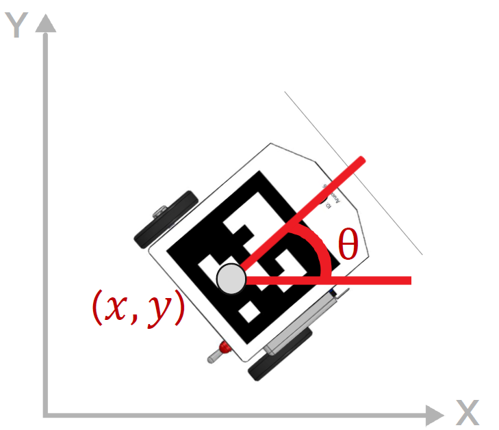
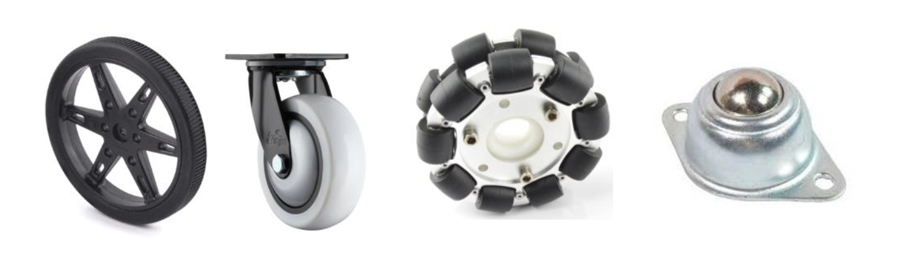
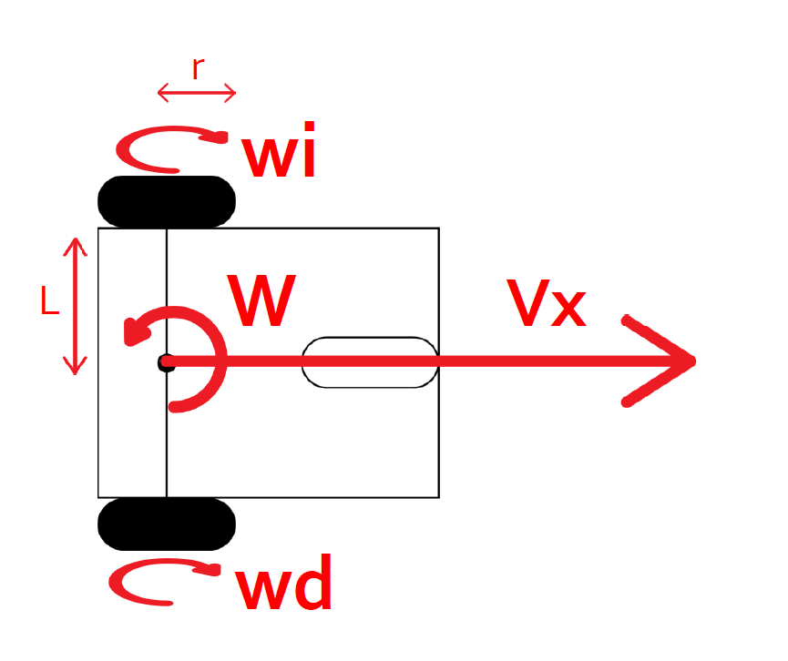
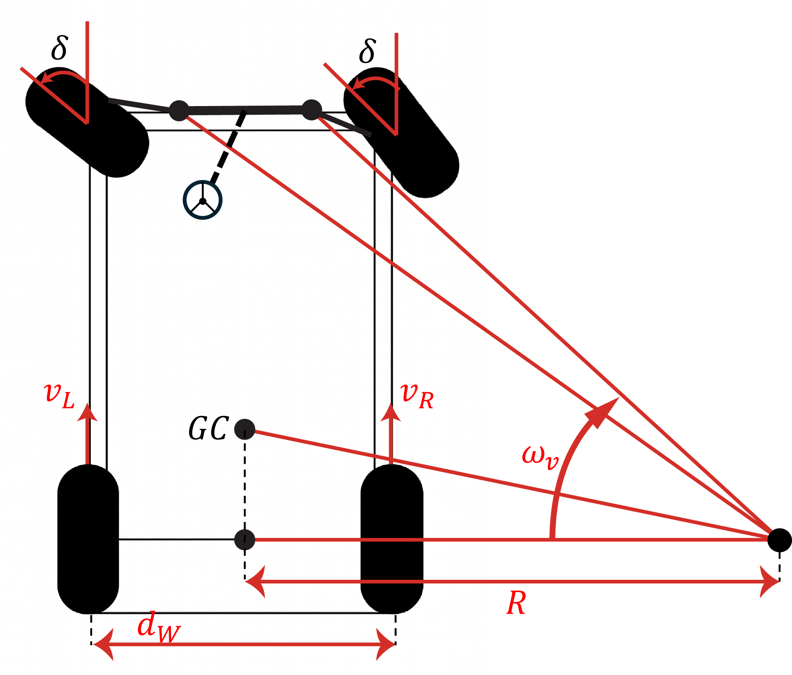
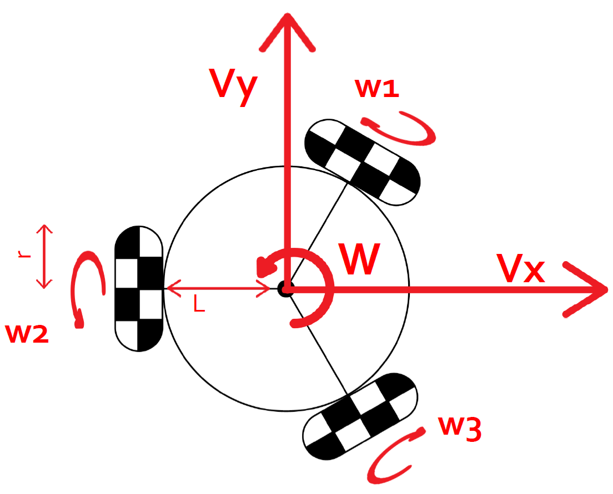
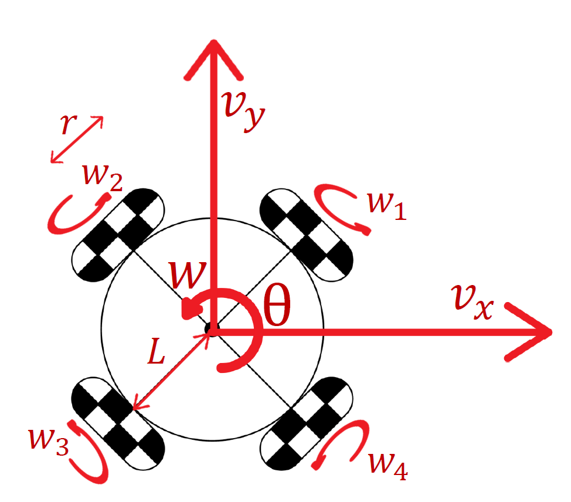
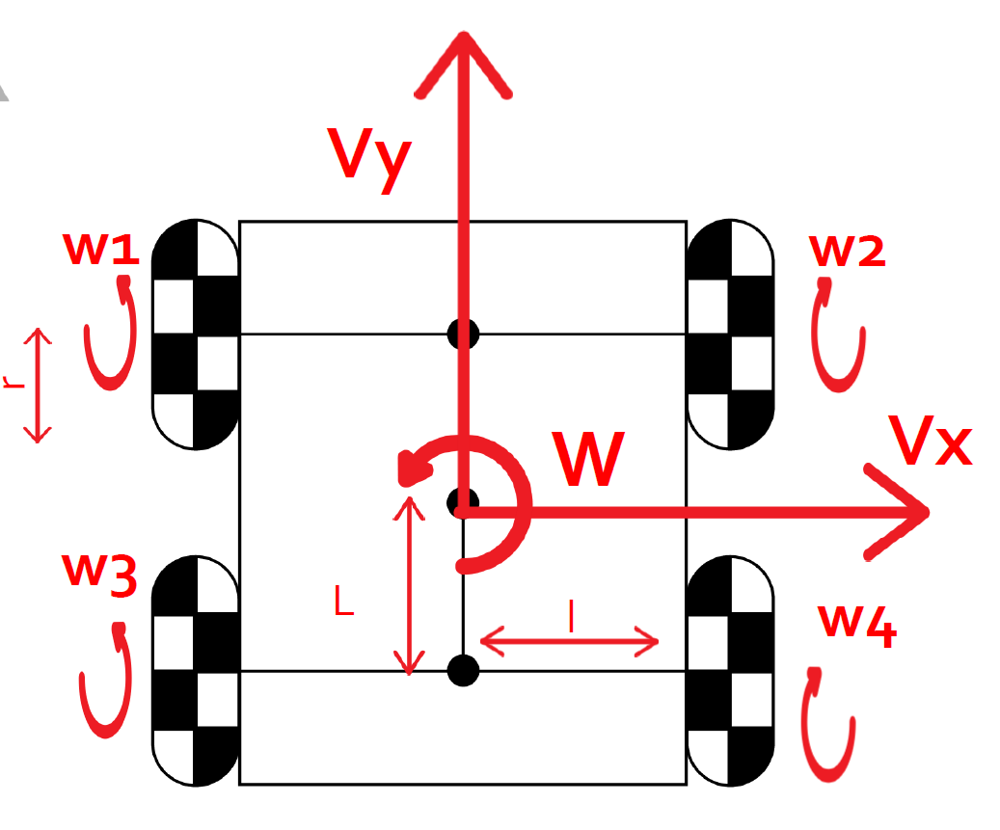

# Mobile Robot Kinematics

---

# 1. What kinematics does for a mobile robot

In previous modules we used the Jacobian as a bridge: it mapped Cartesian velocities into the joint velocities the controller actually needed. The kinematic matrix \(M\) introduced in this module plays exactly the same bridging role, but for mobile platforms — it converts the body velocities the navigation stack commands into the wheel speeds the motors execute. The structure of the problem is the same; what changes is the geometry.

The central question of this module is:

> Given that I want my robot to move with translational velocities \(v_x\), \(v_y\) and angular velocity \(\omega\), at what angular speed must each wheel spin?

For most wheeled platforms the answer is a linear transformation:

\[
\mathbf{w} = \frac{1}{r}\, M \begin{bmatrix} v_x \\ v_y \\ \omega \end{bmatrix}
\]

where \(r\) is the wheel radius, \(\mathbf{w}\) is the vector of wheel angular speeds, and \(M\) is the **kinematic matrix** of the platform. The shape and values of \(M\) depend entirely on the type and arrangement of wheels.

The goal of this module is to understand five common configurations and to identify which one corresponds to your platform.

---

# 2. The robot state in the plane

A mobile robot moving on a flat surface has three degrees of freedom:

\[
\mathbf{q} = \begin{bmatrix} x \\ y \\ \theta \end{bmatrix}
\]

where \(x\) and \(y\) are the Cartesian coordinates of the robot center in the world frame, and \(\theta\) is the heading angle measured from the world \(x\)-axis.

The body-frame velocity components are:

\[
v_x = v \cos\theta, \qquad v_y = v \sin\theta
\]

where \(v\) is the scalar forward speed and \(\omega = \dot\theta\) is the angular velocity. These body-frame velocities are what the kinematic model receives as input.

{width="80%"}

---

# 3. Wheel types and holonomy

Before presenting the four models, it is necessary to understand how the wheel type determines what kinds of motion are possible.

A **fixed wheel** can only roll in one direction. It generates a kinematic constraint that prevents lateral motion. Robots built entirely from fixed wheels are **nonholonomic**: they cannot instantaneously move sideways, even though their workspace is the full plane.

An **omnidirectional wheel** (also called Swedish wheel or omni wheel) has small passive rollers around its perimeter, oriented perpendicular to the rolling direction. This allows the wheel to slide freely in one direction while still transmitting force in the other. Platforms using omni wheels in the right arrangement are **holonomic**: they can move in any direction at any time, regardless of heading.

A **mecanum wheel** is a variant of the omnidirectional wheel where the passive rollers are mounted at 45° to the wheel axis. This gives the platform holonomic motion with a characteristic kinematic coupling between forward, lateral, and rotational speeds.

The wheel type determines whether the robot can track arbitrary Cartesian trajectories without reorienting, which is a key factor for SLAM and autonomous navigation.

{width="80%"}

---

# 4. Model 1 — Differential drive (unicycle)

**Wheel type:** two fixed driven wheels, one or more passive castor supports  
**Motion class:** nonholonomic  
**Independent inputs:** \(v\) (forward speed) and \(\omega\) (angular velocity)

This is the most common mobile robot configuration. It cannot generate lateral velocity directly. To change direction, it must first rotate.

{width="80%"}

The two driven wheels are separated by a distance \(2L\) from the robot center to each wheel. Their angular speeds are:

\[
\begin{bmatrix} w_L \\ w_R \end{bmatrix} = \frac{1}{r} \begin{bmatrix} 1 & -L \\ 1 & L \end{bmatrix} \begin{bmatrix} v \\ \omega \end{bmatrix}
\]

Note that the input here is \((v, \omega)\) rather than \((v_x, v_y, \omega)\). This is not an oversight — it is a consequence of the nonholonomic constraint. The robot cannot command \(v_y\) independently because its fixed wheels prevent lateral sliding. The world-frame velocity components are determined by the heading:

\[
\dot x = v \cos\theta, \qquad \dot y = v \sin\theta, \qquad \dot\theta = \omega
\]

**Inverse kinematics:** given \(w_L\) and \(w_R\) from encoders, recover body velocities:

\[
v = \frac{r}{2}(w_R + w_L), \qquad \omega = \frac{r}{2L}(w_R - w_L)
\]

This inverse is used for odometry in the navigation stack.

**In ROS 2:** `cmd_vel` carries \(v\) as `linear.x` and \(\omega\) as `angular.z`. Nav2 uses `DifferentialDriveKinematics` for this model. TurtleBot3 is a canonical example.

---

# 5. Model 2 — Ackermann steering (car-like)
 
**Wheel type:** two fixed rear driven wheels, two steerable front wheels  
**Motion class:** nonholonomic — cannot rotate in place  
**Independent inputs:** \(v\) (forward speed) and \(\delta\) (front steering angle)
 
Ackermann is the kinematic model of a conventional car. Like the differential drive, it is nonholonomic — the robot cannot move sideways. Unlike differential drive, it also cannot rotate in place: turning requires forward or backward motion, and the minimum turning radius is bounded by the wheelbase and the maximum steering angle.
 
The model is most commonly analyzed using the **bicycle simplification**: replace the two rear wheels with one equivalent rear wheel at the center, and the two front wheels with one equivalent steerable front wheel at the center, separated by the wheelbase \(W_b\).
 
> **Notation note:** two geometric parameters appear in this model and are easy to confuse.
> - \(W_b\) — **wheelbase**: longitudinal distance between the front and rear axles.
> - \(d_W\) — **track width**: lateral distance between the left and right wheels on the same axle.
> These are perpendicular dimensions. The diagram in your reference material labels the lateral dimension \(d_W\); the longitudinal dimension \(W_b\) is the one that appears in the kinematic equations below.
 

 
The kinematic equations of the bicycle model are:
 
\[
\dot x = v \cos\theta, \qquad \dot y = v \sin\theta, \qquad \dot\theta = \frac{v}{W_b}\tan\delta
\]
 
where \(\delta\) is the front wheel steering angle. The sign convention follows the diagram: \(\delta > 0\) produces a turn toward the side the front wheels point.
 
The turning radius measured to the rear axle center for a given steering angle is:
 
\[
R = \frac{W_b}{\tan\delta}
\]
 
This radius is bounded below by the mechanical steering limit \(\delta_{max}\):
 
\[
R_{min} = \frac{W_b}{\tan\delta_{max}}
\]
 
Any path with curvature greater than \(1/R_{min}\) is **kinematically infeasible** for an Ackermann robot. This is the fundamental planning constraint that differs from all other models in this module.
 
**Four-wheel geometry — the Ackermann condition:** in a real car-like robot, both front wheels steer but must do so at different angles to prevent tire scrub. The diagram below shows the geometry: all wheel axes must intersect at the same instantaneous center of rotation (ICR).
 

 
The geometrically correct steering angles are:
 
\[
\tan\delta_{inner} = \frac{W_b}{R - d_W/2}, \qquad \tan\delta_{outer} = \frac{W_b}{R + d_W/2}
\]
 
where \(d_W\) is the full track width as labeled in the diagram. A mechanism that satisfies these two equations simultaneously is said to have **Ackermann geometry**. Note that both front wheels in your diagram are drawn at the same \(\delta\) — this is the bicycle simplification; the true inner and outer angles differ.
 
**Rear wheel speeds:** each rear wheel travels at a different speed because it traces an arc of different radius around the ICR. If \(R\) is the turning radius to the rear axle center:
 
\[
w_{R,inner} = \frac{v}{r}\left(1 - \frac{d_W\,\tan\delta}{2\,W_b}\right), \qquad w_{R,outer} = \frac{v}{r}\left(1 + \frac{d_W\,\tan\delta}{2\,W_b}\right)
\]
 
The inner rear wheel always spins slower than the outer rear wheel. For straight-line motion (\(\delta = 0\)), both rear wheels spin at the same speed \(v/r\).
 
**In ROS 2:** `cmd_vel` carries \(v\) as `linear.x` and the equivalent angular velocity \(\omega = v\tan\delta / W_b\) as `angular.z`. The driver node recovers \(\delta = \arctan(\omega\, W_b / v)\). Nav2 provides `AckermannKinematics` support. Note that when \(v = 0\) the steering angle is undefined — the robot must be moving for angular commands to have physical meaning.

---

# 6. Model 3 — Three omnidirectional wheels at 120°

**Wheel type:** three omnidirectional wheels, equally spaced at 120°  
**Motion class:** holonomic  
**Independent inputs:** \(v_x\), \(v_y\), \(\omega\)

The three wheels are placed at angles \(\beta_1 = 60°\), \(\beta_2 = 180°\), \(\beta_3 = 300°\) from the robot \(x\)-axis. Each wheel can transmit force along its rolling direction and slide freely in the perpendicular direction.

{width="80%"}

The kinematic matrix is derived from the projection of the body velocity onto each wheel's rolling axis:

\[
\begin{bmatrix} w_1 \\ w_2 \\ w_3 \end{bmatrix} = 
\frac{1}{r} 
\begin{bmatrix} 
-\dfrac{\sqrt{3}}{2} & \dfrac{1}{2} & L \\[6pt]
 0 & -1 & L \\[6pt]
 \dfrac{\sqrt{3}}{2} & \dfrac{1}{2} & L 
\end{bmatrix} 
\begin{bmatrix} 
v_x \\ v_y \\ \omega 
\end{bmatrix}
\]

where \(L\) is the radius from the robot center to each wheel.

**Why 120°?** Any symmetric placement generates a matrix whose rows span \(\mathbb{R}^3\), making the system fully controllable. The 120° spacing is the minimum redundancy for a three-wheel holonomic platform.

**Inverse kinematics:** the system is square (3×3), so the body velocity can be recovered exactly from wheel speeds by inverting \(M\):

\[
\begin{bmatrix} v_x \\ v_y \\ \omega \end{bmatrix} = r\, M^{-1} \begin{bmatrix} w_1 \\ w_2 \\ w_3 \end{bmatrix}
\]

**In ROS 2:** requires a custom kinematics plugin or a manual conversion node that subscribes to `cmd_vel` and publishes individual wheel speed commands.

---

# 7. Model 4 — Four Swedish wheels at 45° (circular body)

**Wheel type:** four Swedish or mecanum wheels with rollers at ±45°, arranged on a circular body  
**Motion class:** holonomic  
**Independent inputs:** \(v_x\), \(v_y\), \(\omega\)

Each wheel is placed at distance \(L\) from the robot center. The rollers on each wheel are oriented at 45° to the rolling axis, which introduces a coupling between the three motion components.

{width="80%"}

\[
\begin{bmatrix} w_1 \\ w_2 \\ w_3 \\ w_4 \end{bmatrix} = \frac{1}{r} \begin{bmatrix} \dfrac{\sqrt{2}}{2} & -\dfrac{\sqrt{2}}{2} & -L \\[8pt] \dfrac{\sqrt{2}}{2} & \dfrac{\sqrt{2}}{2} & -L \\[8pt] -\dfrac{\sqrt{2}}{2} & \dfrac{\sqrt{2}}{2} & -L \\[8pt] -\dfrac{\sqrt{2}}{2} & -\dfrac{\sqrt{2}}{2} & -L \end{bmatrix} \begin{bmatrix} v_x \\ v_y \\ \omega \end{bmatrix}
\]

where \(w_1\) is the front-right wheel, \(w_2\) front-left, \(w_3\) rear-left, and \(w_4\) rear-right.

The \(\tfrac{\sqrt{2}}{2}\) coefficients come from the projection of body velocity onto the 45° rolling axis of each wheel.

**Inverse kinematics:** the system is overdetermined (4 equations, 3 unknowns). The minimum-norm solution uses the pseudoinverse:

\[
\begin{bmatrix} v_x \\ v_y \\ \omega \end{bmatrix} = r\, M^{+} \mathbf{w}, \qquad M^{+} = M^T (M M^T)^{-1}
\]

**In ROS 2:** compatible with `MecanumDriveKinematics` from `nav2_kinematics`.

---

# 8. Model 5 — Mecanum wheels on a rectangular body

**Wheel type:** four mecanum wheels with rollers at 45°, arranged on a rectangular body  
**Motion class:** holonomic  
**Independent inputs:** \(v_x\), \(v_y\), \(\omega\)

This is the most common industrial holonomic configuration. Unlike Model 3, the robot body is rectangular, so the distance from the center to the front/rear wheel axes (\(L\)) differs from the distance to the left/right wheel axes (\(l\)).

{width="80%"}

The wheel layout is: \(w_1\) = front-left, \(w_2\) = front-right, \(w_3\) = rear-left, \(w_4\) = rear-right.

\[
\begin{bmatrix} w_1 \\ w_2 \\ w_3 \\ w_4 \end{bmatrix} = \frac{1}{r} 
\begin{bmatrix} 1 & 1 & -(L+l) \\ -1 & 1 & (L+l) \\ -1 & 1 & -(L+l) \\ 1 &  1 & (L+l) \end{bmatrix} 
\begin{bmatrix} v_x \\ v_y \\ \omega \end{bmatrix}
\]

where:

- \(L\) = longitudinal distance from the robot center to the front or rear wheel axis (half-wheelbase),
- \(l\) = lateral distance from the robot center to the left or right wheel column (half-track width).

The term \((L+l)\) replaces the single \(L\) from Model 3 because the wheel positions are no longer equidistant from the center.

**Inverse kinematics:** same pseudoinverse approach as Model 3. Odometry from encoders uses:

\[
\begin{bmatrix} v_x \\ v_y \\ \omega \end{bmatrix} = \frac{r}{4} \begin{bmatrix} 1 & 1 & 1 & 1 \\ -1 & 1 & 1 & -1 \\ \dfrac{-1}{L+l} & \dfrac{1}{L+l} & \dfrac{-1}{L+l} & \dfrac{1}{L+l} \end{bmatrix} \begin{bmatrix} w_1 \\ w_2 \\ w_3 \\ w_4 \end{bmatrix}
\]

**In ROS 2:** compatible with `MecanumDriveKinematics`. Requires accurate measurement of both \(L\) and \(l\) for correct odometry.

---

# 9. Comparison of the five models

| | Differential | Ackermann | Omni 3 wheels | Swedish 45° circular | Mecanum rectangular |
|---|---|---|---|---|---|
| Wheel type | Fixed | Fixed + steerable | Omnidirectional | Swedish / Mecanum | Mecanum |
| Holonomic | ❌ | ❌ | ✅ | ✅ | ✅ |
| Rotate in place | ✅ | ❌ | ✅ | ✅ | ✅ |
| Inputs | \(v,\omega\) | \(v,\delta\) | \(v_x,v_y,\omega\) | \(v_x,v_y,\omega\) | \(v_x,v_y,\omega\) |
| \(M\) size | 2×2 | — | 3×3 | 4×3 | 4×3 |
| Inverse | Exact | Exact | Exact | Pseudoinverse | Pseudoinverse |
| Geometric params | \(L\) | \(W,\, l\) | \(L\) | \(L\) | \(L,\, l\) |
| Min turn radius | 0 | \(W/\tan\delta_{max}\) | 0 | 0 | 0 |
| Nav2 plugin | `DifferentialDrive` | `AckermannKinematics` | custom | `MecanumDrive` | `MecanumDrive` |

The choice of model determines everything downstream: how `cmd_vel` is interpreted, how odometry is computed from encoders, and which Nav2 plugin to configure.

---

# 10. The kinematic model in a ROS 2 system

In a ROS 2 navigation stack, the kinematic model sits between the planner and the hardware. The diagram below shows the complete data flow:

```
Nav2 Planner  →  cmd_vel  →  [Kinematic node]  →  wheel speeds  →  Motors
                                     ↑
                               M and r, L, l
                                     
Encoders  →  wheel speeds  →  [Inverse kinematic node]  →  odom  →  Nav2
```

The kinematic node performs exactly the matrix multiplication shown in sections 4–8. The inverse kinematic node computes odometry from encoder readings using the inverse of \(M\).

Both nodes must use **the same values of \(r\), \(L\), and \(l\)**. Any mismatch causes the robot to drift from its intended path, which SLAM will partially correct but which accumulates over time.

---

# 11. Example — TurtleBot3 with differential drive model

TurtleBot3 Burger uses the differential drive model (Model 1) with the following physical parameters:

- wheel radius: \(r = 0.033\) m
- half wheel separation: \(L = 0.160\) m


When Nav2 publishes `cmd_vel` with \(v = 0.15\) m/s and \(\omega = 0.5\) rad/s, the `turtlebot3_node` computes:

\[
w_L = \frac{1}{0.033}(0.15 - 0.160 \times 0.5) = \frac{0.07}{0.033} \approx 2.12 \text{ rad/s}
\]

\[
w_R = \frac{1}{0.033}(0.15 + 0.160 \times 0.5) = \frac{0.23}{0.033} \approx 6.97 \text{ rad/s}
\]

The right wheel spins faster than the left, producing a left turn. This is the same structure you will implement for your own platform — the only difference is your values of \(r\) and \(L\).

---

# 12. From kinematics to your project

Your platform will interface with Nav2 through the same pipeline as TurtleBot3. The steps to integrate your robot are:

1. Identify your wheel type from the five models in this module.
2. Measure \(r\) and the relevant geometric parameters (\(W\), \(L\), and/or \(l\)) from your laser-cut base.
3. Implement a ROS 2 node that subscribes to `cmd_vel` and applies your model's matrix \(M\) to produce wheel speed commands.
4. Implement the inverse: read encoder ticks, compute wheel speeds, apply \(M^{-1}\) or \(M^{+}\), and publish `odom`.
5. Configure the correct Nav2 plugin in `nav2_params.yaml`.
6. Verify the TF chain: `map → odom → base_link`.

The kinematics is one component. SLAM provides the map. Nav2 provides the planner. Your kinematic node is the bridge between them.

---
